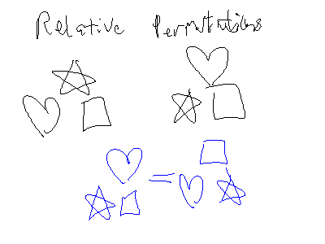

# Counting

> **Goal**: Find out ow many members are present in a finite set.

Some Example Counting Problems:
- If a man has 4 suits, 8 shirts, and 5 ties, how many outfits can he put together?
- How many ways are there to buy 13 different bagels from a shop that sells 17 types?

Solving counting problems usually involves converting problems to set cardinality problems.

# Multiplication Principle

**Multiplication Principle**: If there are $n$ possible outcomes for a first event and $m$ possible outcomes for a second event, then there are $nm$ possible outcomes for the sequence of two events.

> **Mathematical Representation**:
> $$
> | A \times B | = | A | * | B |
> $$

## Examples: Multiplication Principle

> **Example**:
> - A child is allowed to choose *one jelly bean out of two* jellybeans—one red and one black—and *one gummy bear out of three* gummy bears—yellow, green, and white. How many different sets of candy can the child have?
> 
> Solution:
> - There are $2(3) = 6$ possible outcomes.
>	- Because there are 2 possible outcomes for the jellybeans and 3 possible outcomes for the gummy bears.

> **Example**:
> - How many four digit numbers can there be if repetition of numbers are allowed?
> 
> Solution:
> - There are $10 \times 10 \times 10 \times 10 = 10,000$ possible combinations.
>
> Sub-Problem: What if none of the digits can repeat?
> - Solution: $10 \times 9 \times 8 \times 7$ possible combinations.

> **Example**:
> - If a man has 4 suits, 8 shirts, and 5 ties, how many outfits can he put together?
>
> Solution:
> - $4*8*5$ outfits

> **Problem**: How many three-digit integers (numbers between 100 and 999 inclusive) are even?
> 
> Solution:
> $$
> \begin{aligned}
> \text{(1 to 9)} \times \text{(0 to 9)} \times \text{(even digits)} &= \\
> |\{ 1,...,9 \}| \times |\{ 0,...,9 \}| \times |\{ 0,2,4,6,8 \}| &= \\
> 9 \times 10 \times 5 &= 450 \text{ integers}
> \end{aligned}
> $$

# Addition Principle

**Addition Principle**: If $A$ and $B$ are disjoint events with $n$ and $m$ outcomes, respectively, then the total number of possible outcomes for event "$A$ or $B$" is $n+m$

> **Mathematical Representation**:
> $$
> | A \cup B | = | A | + | B |
> $$

## Examples: Addition Principle

> **Example**:
> - A customer wants to purchase a vehicle from a dealer. The dealer has 23 cars and 14 trucks in stock. How many selections does the customer have?
> 
> Solution:
> - They have $23+14=37$ possible selections.

> **Example**:
> - Suppose there are 5 chicken dishes and 8 beef dishes. How many selections does a customer have?
> 
> Solution:
> - They have $5+8=13$ possible selections.

# Example: Using Addition and Multiplication Principle

> **Problem**: How many four-digit numbers begin with a 4 or 5?
> 
> Solution:
> $$
> (1*10*10*10) + (1*10*10*10) = 2,000 \text{ 4-digit numbers}
> $$
> - 4XXX and 5XXX are disjoined, so we can add their individual possibilities together.
> 
> Alternative Solution: (Using only multiplication principle)
> $$
> 2*10*10*10 = 2,000 \text{ 4-digit numbers}
> $$

<!--*-->

# Decision Trees

**Decision Trees**: Trees that provide the number of outcomes of an event based on a series of possible choices.

# Principle of Inclusion and Exclusion

**Theory**: The union of multiple sets can be found by adding (including) all the elements together and then subtracting (excluding) all the intersections that got double-counted.
- Alternate: To find the total number of items in a combined set, add everything up and subtract any overlaps.

## Principle of Inclusion and Exclusion on 2 Sets

If $A$ and $B$ are subsets of universal set $S$, then $(A-B),(B-A),$ and $(A \cap B)$ are disjoint sets. So:

**Principle of Inclusion and Exclusion on 2 Sets**:
$$
	| A \cup B | = | A | + | B | - | A \cap B |
$$

> **Example**: How many integers from 1 to 1000 are either multiples of 3 or multiples of 5?
> 
> $$
> A = \{ \text{Multiples of 3 from 1 to 1000} \} \\
> B = \{ \text{Multiples of 5 from 1 to 1000} \} \\~\\
> \text{Goal: Find $|A \cup B|$} \\~\\
> \begin{aligned}
> 	| A \cup B | &= | A | + | B | - | A \cup B | \\
> 	&= \Bigl\lfloor \frac{1000}{3} \Bigr\rfloor + \Bigl\lfloor \frac{1000}{5} \Bigr\rfloor - \Bigl\lfloor \frac{1000}{15} \Bigr\rfloor \\
> 	&= 457
> \end{aligned}
> $$

## Principle of Inclusion and Exclusion on 3 Sets

**Principle of Inclusion and Exclusion on 3 Sets**:
$$
| A \cup B \cup C | = | A | + | B | + | C | - | A \cap B | - | A \cap C | - | B \cap C | + | A \cap B \cap C |
$$

> **Example**: In a class of students undergoing a computer course the following were observed.
> - Out of a total of 50 students: 30 know Pascal, 18 know Fortran, 26 know COBOL, 9 know both Pascal and Fortran, 16 know both Pascal and COBOL, 8 know both Fortran and COBOL, 47 know at least one of the three languages.
> 
> 1. How many students know none of the languages?
> 	- $50 - 47 = 3$ students.
> 2. How many students know all three languages?
> 
> $$
> | A \cup B \cup C | = 47 \\~\\
> \text{Recall: }
> | A \cup B \cup C | = | A | + | B | + | C | - | A \cap B | - | A \cap C | - | B \cap C | + | A \cap B \cap C | \\~\\
> 47 = 30 + 18 + 26 - 9 - 16 - 8 + |A \cap B \cap C| \\
> \downarrow \\
> |A \cap B \cap C| = 6
> $$

# Pigeonhole Principle

1. If more than $k$ items are placed into $k$ bins, then at least one bin has more than one item.
2. How many people must be in a room to guarantee that two people have the last name begin with the same initial?
	- 26 alphabets, hence 27 people are must be in the room.
3. How many times must a single die be rolled in order to guarantee getting the same value twice?
	- 7 times, because there are 6 possible outcomes.

# Permutations

**Permutation**: *Ordered* arrangement of objects.
- If you change the order, it becomes a different permutation.

The number of permutations of $r$ distinct objects chosen from $n$ distinct objects is denoted by $P(n,r)$

> Example: Suppose we have total pool of 10 students ($n$) and want to know how many ways we can order 5 students ($r$) without repetition.
> 	* $P(10,5): 10 \times 9 \times 8 \times 7 \times 6 = 30240$ ways to order 5 students.

Mathematically, for $r \le n$, an $r$-permutation from $n$ objects is defined by:

$$
P(n,r) = \frac{
	n!
}{
	(n-r)!
}
$$
- for $0 \le r \le n$

> **Tangent**: Deriving permutation formula
> $$
> \begin{aligned}
> 	P(n,r) &= n \times (n-1) \times (n-2) \times ... \times (n-r+1) \\
> 	&= \frac{
> 		n \times (n-1) \times (n-2) \times ... \times (n-r+1) \times (n-r)!
> 	}{
> 		(n-r)!
> 	}
> \end{aligned}
> $$

## Special Cases

**Empty Set**: $P(n,0)=\frac{n!}{n!}=1$
- "There's only one way to order an arrangement of 0 objects."

**Picking Only One Object**: $P(n,1)=\frac{n!}{(n-1)!}=n$
- "There's only one way to order an arrangement of 1 object."

**Arranging $n$ objects**: $P(n,n)=\frac{n!}{0!}=n!$
- This is just the multiplication principle: You can order $n$ objects in $n!$-distinct ways.

## Examples

**Problem**: Ten athletes compete in an Olympic event. Gold, silver and bronze medals are awarded to the first three in the event, respectively. How many ways can the awards be presented?

$$
\text{3 Objects from a Pool of 10: }
P(10,3) = \frac{10!}{7!} = 720
$$

**Problem**: How many ways can six people be seated on six chairs?

$$
P(6,6) = 6! = 720
$$

**Problem**: How many ways can six people be seated in a circle?

$$
\text{In a circle: }=(n-1)!=5!
$$
- Why? Because you can rotate the circle six times. These rotations aren't new permutations because the seating is relative (the rotations aren't unique permutations)

**Problem**: How many permutations of the letters ABCDEF contain the letters DEF together in any order?

1. You can arrange DEF in $P(3,3)=3!$ ways
2. So really, we are arranging A, B, C, and the whole block of DEF
3. Using multiplication principle: $P(3,3) \times P(4,4) = 3! 4!$

**Problem**: The professor’s dilemma: how to arrange four books on OS, seven on programming, and three on data structures on a shelf such that books on the same subject must be together?

$$
\begin{aligned}
\text{All Possible Permutations} &= \text{OS} \times \text{Programming} \times \text{Data Structures} \\
&= [ P(4,4) \times P(7,7) \times P(3,3) \times P(3,3) ] \times P(3,3) \\
&= (4!7!3!)3! \\
&= 4354560
\end{aligned}
$$

## Examples: Eliminating Duplicates

**Problem**: How many distinct permutations can be made from the characters in the word WASHINGTON?
- Pitfall: We can't do $P(10,10)$ because the letter "N" is used twice
- Answer: $\frac{10!}{2!}$, because everything gets counted twice by $10!$

**Problem**: How many distinct permutations can be made from the characters in the word YORK?
- Answer: $P(4,4) = \frac{4!}{0!} = 4!$

**Problem**: How many distinct permutations can be made from the characters in the word ILLINOIS?
- Answer: $\frac{8!}{2!3!}$
	* The $2!$ is for double-counting of the two N's
	* The $3!$ is for triple-counting of the three I's

**Problem**: How many distinct permutations can be made from the characters in the word MISSISSIPPI?
- Answer: $\frac{11!}{4!4!2!}$
	* Divisions account for the 4 S's, 4 P's, and 2 I's. 

# Combinations

If we don't care about order in permutations, we're talking about **combinations**, which can be calculated with:

$$
	C(n,r) = \frac{n!}{(n-r)!r!}
$$

> Note: Relationship between Combinations and Permutations:
> - After each combination, if you order the chosen $r$ objects, you'll be calculating the permutation again (because there are $r!$ ways to order those $r$ chosen objects).
> $$
> C(n,r) \times r! = P(n,r)
> $$
	
> Note: $C(n,r)$ is much smaller than $P(n,r)$ by definition.

## Special Cases

**Empty Set**: $C(n,0) = 1$
- "Only one way to choose $0$ objects from $n$ objects"

**Choosing One Object**: $C(n,1) = n$

**Choosing $n$ Objects From $n$ Objects**: $C(n,n) = 1$

## Examples

**Problem**: How many ways can we select a committee of 3 from 10.

$$
C(10,3) = \frac{10!}{7!3!}
$$

**Problem**: How many ways can a committee of two women and three men be selected from a group of five different women and six different men?

$$
\text{Two Women from 5 Possible: } C(5,2) = \frac{5!}{3!2!}
\\
\text{Three Men from 6 Possible: } C(6,3) = \frac{6!}{3!3!}
\\~\\
C(5,2) \times C(6,3) = \frac{5!}{3!2!} \times \frac{6!}{3!3!}
$$

**Problem**: How many poker hands five-card poker hands contain cards all of the same suit?

$$
C(\text{13 \text{cards in every suit},5 \text{cards in a hand}}) \times 4 \text{ suits} \\
4C(13,5)=5148
$$

**Problem**: How many five-card poker hands can be dealt from a standard 52-card deck?

$$
C(52,5)=2,598,960
$$

# Exercises: Permutations and Combinations

**Problem**: How many permutations of the characters in the word COMPUTER are there? How many of these end in a vowel?

$$
\text{Possibilities: C,M,P,T,R,O/U/E (2x),O/U/E (1x)}
$$
$$
\text{Permutations Ending in a Vowel: } 3 \times 7!
$$

**Problem**: How many distinct permutations of the characters in ERROR are there?

$$
\frac{5!}{3!}
$$

**Problem**: A set of four coins is selected from a box contains five dimes and seven quarters. Find the number of sets which has two dimes and two quarters.

$$
C(5,2) \times C(7,2) = \frac{5!}{3!2!} \times \frac{7!}{5!2!} = 10 \times 21 = 210
$$

**Problem**: How to select a committee of 3, from 4 men and 3 women, where there must be at least 1 man and 1 woman in the committee.

$$
\frac{
C(4,1) \times C(3,1) \times C(3 \text{ (remaining men)} + 2 \text{ (remaining women)},1)
}{
2 \text{ (for double-counting, because different order doesn't make selections unique)}
}
$$
- Double-Counting Explanation: {Alice, Bob, Michael} and {Michael, Bob, Alice} are the same.

**Problem**: How many ways can you seat 11 men and 8 women in a row?

$$
P(19,19) = 19!
$$

**Problem**: How many ways can you seat 11 men and 8 women in a row if all the men sit together and the women sit together?

$$
11! \times 8! \times 2!
$$

**Problem**: How many ways can you seat 11 men and 8 women in a row where no 2 women are to sit together?

$$
11! \text{ (ways to arrange the men)} \times P(12,8) \text{ (places for the eight women to sit)}
$$

**Problem**: How many ways can you seat 11 men and 8 women in a circle where no 2 women are to sit together?

$$
10! \text{ (ways to arrange the men in the circle)} \times P(11,8)
$$

