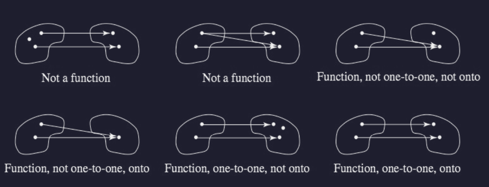

# Properties Example

$$
\rho = \{ \frac{p}{q}, \frac{q}{p} \}
$$
- Is symmetric, is not reflexive or transitive

# Functions (Mappings)

Let $S$ and $T$ be sets.
$$
S = \{ (1,2) \} \qquad T = \{ a,b,c \}
$$

A **function** $f$ from $S$ to $T$ ($f:S \to T$) is a subset of $S \times T$ ($f \subseteq S \times T$)
- Each member of $S$ can appear **only once** as the first component of an ordered pair.
	* Suppose $(s,t)$ belongs to the function, then $t$ can be denoted by $f(s)$
		+ **Preimage**: $s$ ("preimage of $t$ under $f$")
		+ **Image**: $t$ ("image of $s$ under $f$")
- **Domain**: $S$
- **Codomain**: $T$
- **Range**: $f(s) \subseteq T$
	- Set of images smaller than the codomain

For $A \subseteq S$, $f(A)$ denotes $\{ f(a) | a \in A \}$

> **Summary: Three Parts of a Function**
> 1. A set of starting values
> 2. A set from which associated values come
> 3. The association itself

---

These rules for a function mean that functions can't have a binary relation that is one-to-many or many-to-many.

# Floor Function and Ceiling Function

**Floor Function**: floor(x)$
- Associates with each real number $x$ the greatest integer less than or equal to $x$

**Ceiling Function**: ceil$(x)$
- Associates with each real number $x$ the smallest integer greater than or equal to $x$.

> Note: Both floor and ceil domains' are all real numbers.

# Equal Functions

**Equal Functions**: Two functions are equal if they have the same:
1. Domain,
2. Codomain, and
3. Association of values

> **Example**: Suppose:
> - $g$: $R \to R$, where $g(x) = x^3$
> - $f$: $Z \to R$, given by $f(x) = x^3$
> 
> Then:
> - $f$ is not the same function as $g$, because $g$ has a different domain than $f$ (all real numbers $\ne$ all real integers)
> 	* e.g., $g$ can have $(1.1, 1.331$) while $f$ cannot

# Onto (Surjective) Functions

**Onto Function**: Function where the range of $f$ equals the codomain of $f$
- "Every node has an association"

To prove that a given function is onto:
1. Show that $T \text{(domain)} \subseteq R \text{(range)}$ (this proves that $R = T$)
2. Show that an arbitrary member of the codomain is a member of the range.

# One-to-One (Injective) Functions

**One-to-one Function**: Function ($f:S \to T$) where no member of $T$ is the image under $f$ of two distinct elements of $S$.

To prove that a function is one-to-one, we assume that there are elements $s_1$ and $s_2$ of $S$ with $f(s_1) = f(s_2)$ and then show that $s_1 = s_2$

# Bijective Functions

**Bijective Function**: Function ($f: S \to T$) that's both one-to-one and onto. 

# Composition of Functions

Suppose $f: S \to T$ and $g: T \to U$

**Composition Function**: Function ($g \circ f$) from $S$ to $U$ defined by $(g \circ f)(s) = g(f(s))$
- Applied right-to-left ($f$ applied, then $g$)
- Preserves properties of being onto and one-to-one.

> **Theorem on Composing Two Bijections**: The composition of two bijections is a bijection.
> - Ergo, suppose $f: S \to T$ and $g: T \to U$ are onto, then $g \circ f$ is also onto.

# Next Lecture

Next lecture (Tuesdau) will be a review section.

Each student can choose one of the four homework and make it up.
- A new list of questions will be given and answers will be turned in via paper on next Thursday.

Finals will probably be graded within a day because Prof. has to travel lol.

# Composition of Functions Cont.

Suppose $f: S \to T$ and $g: T \to U$

**Composition Function**: Function ($g \circ f$) from $S$ to $U$ defined by $(g \circ f)(s) = g(f(s))$
- Applied right-to-left ($f$ applied, then $g$)
- Preserves properties of being onto and one-to-one.

> **Theorem on Composing Two Bijections**: The composition of two bijections is a bijection.
> - Ergo, suppose $f: S \to T$ and $g: T \to U$ are onto, then $g \circ f$ is also onto.

---

**Example**:
$$
R \to R, f(x)=x^2 \qquad R \to R, g(x) = x-1
$$
$$
f \circ g(x) = (x-1)^2 \qquad g \circ f(x) = x^2 - 1
$$

# Inverse Functions

**Identity Function**: Function that maps each element of a set $S$ to itself, leaving each element of $S$ unchanged ($i_s$).
- Suppose $f: S \to S$ is a bijection.
	* Because $f$ is onto, every $t \in T$ has a preimage in $S$.
		+ Because $f$ is one-to-one, each preimage is unique

**Inverse Function**:
- Suppose $f: S \to T$ and $g: T \to S$ such that $g \circ f = i_s$ and $f \circ g = i_p$; then $g$ is the inverse function of $f$, denoted for $f^{-1}$

> **Theorem on Bijections and Inverse Functions**:
> - If $f:S \to T$, then $f$ is a bijection if and only if $f^{-1}$ exists

---

> **Example**: Suppose $S = \{ 1,2,3 \}$ and $T = \{ a,b,c \}$, and that
> - $S \to T: f = \{ (1,a), (2,b), (3,c) \}$
> - $T \to S: g = \{ (a,1), (b,2), (c,3) \}$
> 
> Then:
> - $f \circ g = \{ (a,a), (b,b), (c,) \} = i_T$
> - $g \circ f = \{ (1,1), (2,2) (3,3) \} = i_S$

---

> **Example**: Suppose $S = \{ 1,2,3 \}$ and $T = \{ a,b,c \}$, and that
> - $S \to T: f = \{ (1,a), (2,b), (3,b) \}$
> 
> Identifying $f$:
> - This is not one-to-one because $b$ gets connected-to twice.
> - This is not onto because $C$ isn't used.
> 	* Remember the layman definition of onto function: "Every node has an association"

---

> **Example**: Suppose $S = \{ 1,2,3 \}$ and $T = \{ a,b,c \}$, and that
> - $S \to T: f = \{ (1,a), (2,b), (3,c) \}$
> 
> Identifying $f$:
> - This is one-to-one because each thing has at most one mapping
> - This is onto because every ode is mapped
> - Thus, this is a bijection.

