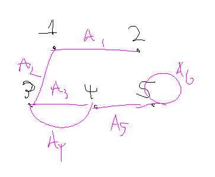
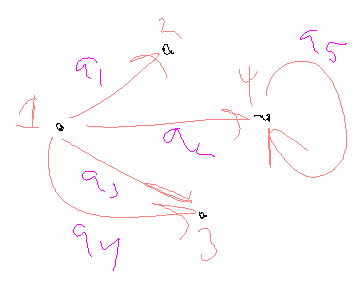

# Definitions of a Graph

**Informal Definition of a Graph**: A graph is a nonempty set of *nodes* (vertices) and a set of *arcs* (edges) such that arc connects two nodes.
- Our graphs will always have a finite number of nodes and arcs.

**Formal Definition of a Graph**: A graph is an ordered triple $(N,A,g)$ where:
- $N =$ a nonempty set of *nodes* (vertices)
- $A =$ a set of *arcs* (edges)
- $g =$ a function associating which each arc $a$ and an *unordered* pair $x$-$y$ of nodes called the endpoints of $a$

## Example

Sketch a graph having nodes $\{ 1,2,3,4,5 \}$, arcs $\{ a_1, a_2, a_3, a_4, a_5, a_6 \}$, and function $g(a_1) = 1-2$, $g(a_2) = 1-3$, $g(a_3)=3-4$, $g(a_5)=4-5$, and $g(a_6)=5-5$

# Directed Graphs

**Informal Definition of a Directed Graph**: Graph where the arcs of a graph begin at one node and end at another.
- Layman: The arcs have directions now.

**Formal Definition of a Directed Graph**: A directed graph is an ordered triple $(N,A,g)$ where:
- $N =$ a nonempty set of *nodes* (vertices)
- $A =$ a set of *arcs* (edges)
- $g =$ a function associating with each arc $a$ and *ordered* pair $(x,y)$ of nodes where $x$ is the initial point and $y$ is the terminal point of $a$.

## Example

- $g(a_1)=(1,2)$
- $g(a_2)=(1,4)$
- $g(a_3)=(1,3)$
- $g(a_4)=(3,1)$
- $g(a_5)=(5,5)$

# Tangent (???): Counting Edges of Graphs

Suppose a fully-connected undirected graph with $n$ nodes. How many ways can you connect the nodes?
$$
C(n,2)
$$

Suppose a non-self-pointing fully-connected directed graph with $k$ nodes. How many ways can you connect the nodes?
$$
P(k,2)
$$

# Tree Terminology

**Informal Definition of Tree**: Special type of graph, very useful for representation of data
- Search algorithms and databases are based on trees.

**Formal Definition of Tree**: Acyclic, connected graph with one node designated as the root of the tree.
- **Acyclic**: There are no loops. In other words, there's no way to traverse backwards once you've followed a node down.
- You can't have multiple roots within one tree.
- If there is no designated root, the tree is considered **nonrooted** or **free**; and not that useful in computer science.

## More Tree Terminology
- **Depth of Node**: Length of the path from the root to a node. 
	* The root itself has a depth of 0.
- **Depth (Height) of the Tree**: Maximum depth of any node in the tree.
- **Leave**: Node with no children
- **Internal Nodes**: Non-leaves
- **Forest**: Acyclic graph (not necessarily connected)

## Binary Trees

**Binary Tree**: Tree where each node has *at most* two children.
- Each child is designated as either the **left child** or **right child**.
- **Full Binary Tree**: Tree where all internal nodes have two children and all leaves are at the same depth.
	* In other words: You can't add more nodes without extending the height of the tree.
- **Complete Binary Tree**: Almost-full binary tree where bottom level of the tree if filling from left to right but may not have its full complement of leaves.

# Defining Trees Recursively

We can define trees recursively with a base case node and some rules to define children and parents.

# Today's Plan

- Final exam will be cumulative
- This lecture we'll be finishing up graphs, reviewing midterm problems, and going over some homework problems.

# Applications of Trees

Trees allow us to efficiently search a collection of records to locate a particular record or determine that a record is not in the collection:
- Files stored on a computer are organized in a hierarchical (treelike) structure.
- Algebraic expressions involving binary operations can be represented by labeled binary trees

# Tree Traversal Algorithms

> Traversal: Goal is to visit every node in the tree. 

**Preorder Traversal**: The root of the tree is visited first, and then the subtrees are processed left to right, each in preorder.

**Inorder Traversal**: Left subtree is processed by an inorder traversal, then the root is visited, and then the remaining subtrees are processed from left to right, each in inorder.

**Postorder Traversal**: Root is visited last, after all subtrees have been processed from left to right in postorder.
