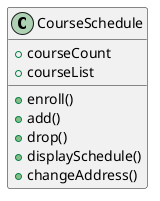
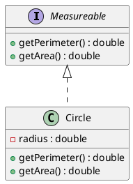

# Object-Oriented Programming

1. **Encapsulation**
	- Information/implementation hiding.
		- Fields and methods are hidden.
	- Only necessary information is shown.
2. **Inheritance**
	- 
3. **Polymorphism**

**Abstraction**: Focus on what instead of the how.
- What needs to be done?
	* For the moment, ignore how it'll be done.
- Divide *class* into two parts:
	1. **Client Interface** (**Abstract Data Type**)
		- Headers of public methods
		- Public constants
	2. **Implementation**
		- Private data fields
		- Private constants
		- All method definitions

# Default Methods for All Objects

- `equals()`
	* When not overridden, compares memory addresses of two objects.
- `hashCode()`
	* When not overridden, returns the memory address.

# Specifying Methods

**Preconditions**
- Must be true before method executes.
	- e.g., This input array must be length > 0 and non-NULL.

**Postconditions**
- Statement of what is true after method executes.

## **`Assert` Statement**:

> **Format**: `assert <expression> : "<message>`
- `assert"`: Throws an `AssertionError` if the statement is true.
	* Use this to catch fatal bugs originating from outside the method.
		+ Defensive programming
	* Requires a special flag to work.
		+ Not used in production.

> **Example**: Using `assert`
> ```java
> assert head != null : "head is a null pointer"
> ```

# Abstract Classes and Methods

## Abstract Classes

> **Format**:
> ```java
> public abstract class ClassName
> ```

**Abstract Class**:
- Is used to ensure that a subclass implements a method.
- Cannot be instantiated.
	- Other classes can inherit from it.
- Serves as a superclass for other classes
- Represents the generic of abstract form of all the classes that are derived from it
- Appears in a superclass but must be overridden in a subclass
	* If a subclass fails to override an abstract method, the compiler will generate an error
- Methods only have a header and no body.
	* Unless the method is `default`.

## Abstract Methods

> **Format**
> ```java
> AccessSpecifier abstract ReturnType Methodname(ParameterList);
> ```
> - Notice how the header ends with a semicolon.
> - Any class that contains an abstract method is automatically abstract.

Abstract classes are drawn like regular class in UML, except the name of the  class and abstract methods are italicized.

Non-abstract classes are called concrete classes.

# Java Interfaces

**Interface**: Program component that declares a number of public methods.
- Like a class, except it only has abstract methods.
	- Has method headers and no body.
- Should include comments to inform programmer.
	* Preferably Javadoc
- Data fields can only be `public`, `final`, or `static`
	* You **cannot** have `private` or `protected` methods in an interface!
	* Since all methods are `public`, you can omit it.
- Only works with inheritance
- Keyword: `implements`
	* A class can implements more than one interface.

> **Note**: Java only supports single inheritance
> - You can't `extends` more than one class.
> - However, you can mimic multiple inheritance a little with Java interfaces
>	- The problem is that you can't have instance fields in interfaces.

> **Example**: Using an interface
> 1. The interface:
> ```java
> public interface Measureable {
> 	double getPerimeter();
> 	double getArea();
> }
> ```
> 2. At the top of the `Circle` class:
> ```java
> class Circle implements Measureable
> ```
> 
> In this example you can have a `Measureable` reference variable that can reference objects of *any type* that implement `Measureable`, like so:
> 
> 3. Somewhere in the client:
> 
> ```java
> public class Client {
> 	public static void main(String[] args) {
> 		Measureable c = new Circle();
> 		c.getArea();
> 	}
> }
> ```

> **Note**: Default Methods
> - Suppose you want to add a new method to your interface, but you don't want to break existing code that use it.
> 	- You can use default methods to avoid breaking other code.

## Interface v.s. Abstract Classes

- You can't define any fields in interfaces!
- Interface is not a class.
- Both can't be instantiated.
- A class can implement several interfaces but can extend only one abstract class.

Use an abstract class if you want to:
1. Provide a method definition, or
2. Declare a private data field that your classes will have in common.

# Choosing Classes

1. Who'll use the system?
2. What can each actor do?
3. What scenarios involve common goals?

**Example**: Designing a registration system for a school

**Users:**
- Student
- Registrar

**Common Things Student and Registrar Can Do:**
- Enroll
- Add/Drop Course
Display Course Schedule
- Change Address



# UML Interface Example



# Reusing Classes

Most software is created by reusing existing components.
- Saves time and money.
