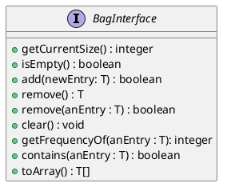

# Data Organization in Real Life

**A lot of things in real life can be implemented with certain data structures.**

- Standing in a line
	* e.g., Everyone gets served in order
	* *Queue data type*
- Stack of books
	* e.g., Last book you put on the stack will be the first you can take out
	* *Stack data type*
- To-do list
	* e.g., You can delete items from the to-do list
	* *List data type*
- Dictionary
	* e.g., Searching for definition (value) associated with words (key)
	* *Dictionary data type*
- Folders
	* e.g., Directory trees
	* *Tree data type*
- Road map
	* e.g., Cities connected by roads
	* *Graph data type*

# Computer Data Organization

**Abstract Data Type**: 
- *Specification* of a data set and the operations on that data
	* Doesn't indicate how to store the data or implement operations.
- *Independent* of any programming language.

$$
\text{ADT in Java} = \text{Interface} + \text{Class}
$$

**Data Structure**: 

**Collection**: 

> **Examples**: Containers
> - Bag
> - List
> - Stack
> - Queue
> - Dictionary
> - Tree
> - Graph

# Design Decisions

**What do you do for unusual conditions?**
- Assume it won't happen
- Ignore them
- Guess the client's intention
- Return a value that signals a problem
	* e.g., return a boolean
- Throw an exception
	- Don't use this needlessly!
	- Remember to write good exception messages!

> **Example**: Throwing an exception
> ```java
> throw new Exception("Exception message");
> ```

# Observations about Vending Machines

- You can't access the inside of the machine,
- But, so long as you know how to use it, you can use any vending machine regardless of internals.
	* It doesn't matter whether it's using Link or ArrayList or whatever internally.

# Bag Abstract Data Type

**Definition**:
- Finite collection of objects
- No particular order
- Can contain duplicates

**Operations**:
- Count number of items
- Check for empty
- Add/remove items

> **Metaphor**: Bag of groceries

## CRC (Class-Responsibility-Collaboration) Card

**Responsibilities**:
- Get the number of items in the bag
- See whether bag is empty
- Add given object
- Remove unspecified object
- Remove particular object
- Remove all objects from bag
- Count number of times a certain object occurs in the bag
- Test whether bag contains a particular object
- Look at all objects in the bag

**Collaboration**:
- That class of objects that the bag can contain

## Interface UML



## Example Interface

> **Remember**: The interface is wholly interface-independent. No constructor, no fields, no comments about any implementation details.

**Interface**:
```java
// "T" is a generic type parameter
// - (So the bag can store any type of object)
public interface BagInterface<T> {
	int getCurrentSize();
	boolean isEmpty();
	boolean add(T newEntry);
	boolean remove();
	boolean remove(T anEntry);
	void clear();
	integer getFrequencyOf(T anEntry);
	boolean contains(T anEntry);
	T[] toArray();
}
```

**Implementation**:
```java
public class Coin implements BagInterface {
	// we'll cover implementation after learning generics
}
```

<!--
**Implementation**:
```java
public class Coin implements BagInterface {
	// ...
	// possible ways to implement BagInterface:
	// - partially-filled array
	// - normal array
	// - parallel array
	// ...
	private int size;
	private T[100] array;
	public int getCurrentSize() {
		return this.size;
	}
	public boolean isEmpty() {
		return (this.size == 0);
	}
	public boolean add(T newEntry) {
		final int NEW_SIZE = size + 1;
		if (NEW_SIZE > 100 || newEntry == NULL)
			return false
		this.array[NEW_SIZE] = newEntry;
		this.size = NEW_SIZE;
		return true;
	}
	public boolean remove() {
		final int NEW_SIZE = size - 1;
		if (NEW_SIZE < 0)
			return false;
		this.size = NEW_SIZE;
		return true;
	}
	public boolean remove(T anEntry) {
		int index = 0;
		for (T entry : array) {
			if (entry.equals(anEntry)) {
				index++;
				break;
			}
		}
		for (int i = index; i < this.size - 1; i++) {
			this.array[i] = this.array[i + 1];
		}
		this.remove();
	}
	public void clear() {
		while (this.size != 0)
			this.remove();
	}
	public integer getFrequencyOf(T anEntry) {
		int count = 0;
		for (T entry : array)
			if (entry.equals(anEntry))
				count++;
		return count;
	}
	public boolean contains(T anEntry) {
		for (T entry : array)
			if (entry.equals(anEntry))
				return true;
		return false;
	}
	public T[] toArray() {
	}
}
```
-->

**Client**:
```java
public class PiggyBank {
	private BagInterface<Coin> coins;
	public PiggyBank() {
		this.coins = new Bag<>();
	}
	public boolean add(Coin aCoin) {
		return coins.add(aCoin):
	}
	public Coin remove() {
		return coins.remove();
	}
	public boolean isEmpty() {
		return coins.isEmpty();
	}
}
```

**Example Use**:
```java
public class Client {
	public static void main(String[] args) {
		PiggyBank bank = new PiggyBank();
	}
}
```

## Observations about Bag ADT

- Can only perform tasks specific to ADT.
- Must adhere to the specifications.
- Can't access data inside without using the operations.
- Usable even with new implementations.

# Set Interface

```java
public interface SetInterface<T> {
	int getCurrentSize();
	boolean isEmpty();
	boolean add (T newEntry);
	boolean remove (T anEntry);
	T remove();
	void clear();
	boolean contains(T anEntry);
	T[] toArray();
	// etc...
}
```
