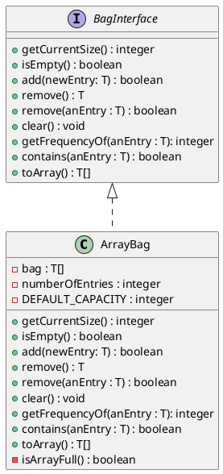

# Fixed-Size Array

aka: Partially-filled array.

**Metaphor**:
- A classroom has seats in fixed positions

# `ArrayBag`

## UML



## Code

> **Note**: `final` on a class.
> - You can't extend a `final` class.


```java
public final class ArrayBag<T> implements BagInterface<T> {
	private final T[] bag; // Remember, this is an array of Object!
	private int numberOfEntries;
	private static final int DEFAULT_CAPACITY = 25;
	public ArrayBag() {
		this(DEFAULT_CAPACITY);
	}
	public ArrayBag(int capacity) {
		numberOfEntries = 0;
		@SuppressWarnings("unchecked")
		T[] tempBag = (T[]) new Object[capacity]; // Unchecked cast
		this.bag = tempBag; // This is the first initialization of bag, which is why we can do this despite bag being final.
	}
	public T[] toArray() {
		@SuppressWarnings("unchecked")
		T[] result = (T[]) new Object[numberOfEntries];
		for (int i = 0; i < numberOfEntries; i++)
			result[i] = bag[i];
		return result; // remember that this is an array of Object, not T!
	}
	/*
	...etc
	*/
}
```

> **Remember**:
> - You cannot instantiate a generic object.
> - You cannot instantiate an array of generic objects.
>
> This is why we need to cast to-and-from objects.

> **Type-Erasure**: The generic type gets removed when being returned.

# Making the Implementation Secure

> **Note**: `new` can throw an unchecked exception when the JVM can't allocate memory.
> - This is why we don't *need* to surround `new` with `try` and `catch`.

Practice fail-safe programming by including checks for anticipated errors.
- Validate input data and arguments to a method

> **Example**: Refining ArrayBag
> - We could add these two fields:
> ```java
> private boolean integrityOk = false;
> private static final int MAX_CAPACITY = 100000;
> ```
> 
> ```java
> public ArrayBag(int capacity) {
> 	if (capacity > MAX_CAPACITY)
> 		throw new Exception("Invalid capacity");
> 	numberOfEntries = 0;
> 	@SuppressWarnings("unchecked");
> 	try {
> 		T[] tempBag = (T[]) new Object[capacity]; // Unchecked cast
> 		this.bag = tempBag; // This is the first initialization of bag, which is why we can do this despite bag being final.
> 	} catch {
> 		throw new Exception("Bag is [corrupt](corrupt)");
> 	}
> 	integrityOk = true;
> }
> private void checkIntegrity() {
> 	// TODO
> }
> ```

# Resizing an Array

To resize an array you'll need to create a new array, copy by value, and change the references.
- The difficult part of the problem is designing *how much* to resize.

# Pros and Cons of Using Array

- Fast addition
- Fast unspecified removal
- Removing a particular entry is slow because of searching
	* (Linear search is $O(n)$)
- Resizing the array takes time to copy its entries.
