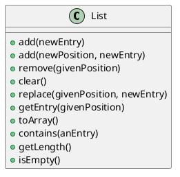

# List

**List**: Way to organize data.
- Items have [position]{.underline}.
	* May or may not be important.
- Items may be added anywhere.
- *Metaphors: To-do list*

> **List v.s. Array**: 
> - [List is 1-indexed]{.underline} (in this class).
> - Array has limits.
>	- e.g., adding/removing from the middle

> **Example**: Demonstrating how data shifts in a list
> 
> ```java
> list.add(1, "Amy");
> list.add(2, "Elias");
> list.add(2, "Bob");
> list.add(3, "Drew");
> ```
> 
> 1. Aaron
> 1. Amy
> 2. Elias
> 3. Bob
> 4. Drew

## Specification



| Pseudocode                         | Description                                |
|------------------------------------|--------------------------------------------|
| `add(newEntry)`                    | Add an item to the end of the list         |
| `add(newPosition, newEntry)`       | Add an item anywhere in the list           |
| `remove(givenPosition)`            | Remove an item anywhere in the list        |
| `clear()`                          | Remove all entries from the list           |
| `replace(givenPosition, newEntry)` | Replace an element at an index             |
| `getEntry(givenPosition)`          | Get the entry at a position                |
| `toArray()`                        | Return list as an array                    |
| `contains(anEntry)`                | Returns whether the list contains an entry |
| `getLength()`                      | Returns number of items in the list        |
| `isEmpty()`                        | Returns whether list is empty              |

> **Example**: Interface
> ```java
> public interface ListInterface<T> {
> 	void add(T newEntry)
> 	void add(int newPosition, T newEntry)
> 	T remove(int givenPosition)            
> 	void clear()                          
> 	T replace(int givenPosition, T newEntry) 
> 	T getEntry(int givenPosition)          
> 	T[] toArray()                        
> 	boolean contains(T anEntry)                
> 	int getLength()                      
> 	boolean isEmpty()                        
> }
> ```

## Java Class Library: The Interface `List`

```java
void add(int index, T newEntry);
T remove(int index);
void clear();
T set (int index, T anEntry);
T get (int index);
boolean contains(Object anEntry);
int size();
boolean isEmpty();
```

# Iterators for the ADT List

> **Note**: If you implement the iterator as a separate class rather than an inner-class, you need to finagle with the list's methods.

**Inner-Class Iterator**

```java
public interface ListInterface<T> extends Iterable<T>
```

```java
public Iterator<T> iterator() {
	// return the private iterator
}
private class IteratorForLinkedList implements Iterator<T> {
	private Node nextNode;
	private IteratorForLinkedList() {
		nextNode = head;
	}
	//
	public T next
}
```
