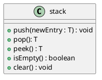

# Stack

**Stacks**:
- Add items to the top of stack.
- Remove items from the top of the stack.
- **LIFO**: Last In, First Out.
	- *Metaphor: The last dish you add to a stack of dishes is the first one you can take out.*
- **Contents** (Data): Collection of objects in reverse chronological order and having the same data type.

## Specification

| Pseudocode | Description                                                |
|------------|------------------------------------------------------------|
| push       | Adds a new entry to the top of the stack                   |
| pop        | Removes and returns the stack's top entry                  |
| peek       | Retrieves the stack's top entry without changing the stack |
| isEmpty    | Returns whether the stack is empty                         |
| clear      | Removes all entries from the stack                         |



> **Note**: You cannot see anything except the top element in a proper stack ADT!
> - Don't implement extra features that go against the specification!
>	- This means no `toArray`!

> **Example**: Stack interface
> ```java
> public interface StackInterface<T> {
> 	void push(T newEntry);
> 	T pop();
> 	T peek();
> 	boolean isEmpty();
> 	void clear();
> }
> ```

## Design Decisions

**Case**: Stack is empty, what to do with `pop` and `peak`?
1. Assume it isn't empty
2. Return `null`
3. Throw an exception.

**Security Note**:
- Don't trust the client to use public methods correctly
- Avoid ambiguous return values
- Prefer throwing exceptions rather than returning values to indicate problems.

# Using Stack on Algebraic Expressions

> **Relevancy**: *"The most important ADT in computer science"*
> - We wouldn't have methods or recursion without stacks!
> - [In this introduction we'll be using the stack to manipulate algebra.]{.underline}
>	- The techniques are universal, and used everywhere.

## Infix, Prefix, Postfix

**Algebraic Notation**:
1. **Infix**: Each binary operator appears between its operations
2. **Prefix**: Each binary operator appears before its operands
	* *(We won't really touch prefix, we're more interested in infix and postfix)*
3. **Postfix**: Each binary operator appears after is operands
	* *aka: Reverse Polish Notation*

> **Example**: The same expression in infix, prefix, and postfix
> ```
> # Infix
> a + b
> # Prefix
> + a b
> # Postfix
> a b +
> ```

> **Example**: The same expression in infix, prefix, and postfix
> ```
> # Infix
> a + b / c 
> # Prefix
> + a / b c
> # Postfix
> a b c / +
> ```

> **Warning**: Keep terms on their original sides when converting expressions
> - Using the associative rule to switch sides will lose points.

## Testing Balanced Expressions

> **Balanced Expression**: An expression with matching brackets and parenthesis.

**Q**: How do you tell if an infix expression is balanced?

**A**: Read the expression character-by-character, and:
1. Push each opening symbol (e.g., `[`, `{`) to the stack as you read it
2. Pop each closing symbol (e.g., `]`, `}`) from the stack as you read it
	- If the return value of the pop doesn't match the closing symbol you're reading, the expression is unbalanced.
3. When/if you reach the end of the expression:
	- If the stack isn't empty, the expression is unbalanced
	- If the stack is empty, the expression is balanced.

## Converting Infix $\to$ Postfix

Q: How do you programmatically convert an infix expression $\to$ postfix?

**A**: Read the expression character-by-character and use a stack to store operators:
1. Variables (e.g., `a`, `b`) get appended to the postfix expression as we read them.
2. Operators (e.g., `-`, `+`) get pushed into the operator stack as we read them.
	- [Move operator(s) from the stack to the postfix expression]{.underline} when:
		* At the **end of the expression**, or
		* When an **operator** being added to the stack **has lower-or-equal precedence** to the one currently on the top of the stack.
	- *Special Case: A closing parenthesis will pop everything off the stack until you reach the next opening parenthesis in the stack*

> **Remember**: The parenthesis themselves don't get added into postfix notation.

> **Example**: Converting infix $\to$ postfix with a stack
> 
> 1. Infix Expression: $a+b*c$
> 
> | Current Character | Postfix Form | Operator Stack |
> |-------------------|--------------|----------------|
> | $a$               | $a$          |                |
> | $+$               | $a$          | $+$            |
> | $b$               | $ab$         | $+$            |
> | $*$               | $ab$         | $+*$           |
> | $c$               | $abc$        | $+*$           |
> |                   | $abc*$       | $+$            |
> |                   | $abc*+$      |                |
> - Thus, the postfix form of $a+b*c$ is $abc*+$
> 
> 2. Infix Expression: $a - b + c$
> 
> | Current Character | Postfix Form | Operator Stack |
> |-------------------|--------------|----------------|
> | $a$               | $a$          |                |
> | $-$               | $a$          | $-$            |
> | $b$               | $ab$         | $-$            |
> | $+$               | $ab-$        | $+$            |
> | $c$               | $ab-c$       | $+$            |
> |                   | $ab-c+$      |                |
> - Thus, the postfix form of $a-b+c$ is $ab-c+$
> 
> 3. Infix Expression: $a$ ^ $b$ ^ $c$
> 
> | Current Character | Postfix Form | Operator Stack |
> |-------------------|--------------|----------------|
> | $a$                 | $a$            |                |
> | ^                 | $a$            | ^              |
> | $b$                 | $ab$           | ^               |
> | ^                 | $ab$ ^          | ^              |
> | $c$                 | $ab$ ^ $c$         | ^              |
> |                   | $ab$ ^ $c$ ^        |                |
> - Thus, the postfix form of $a$ ^ $b$ ^ $c$ is $ab$ ^ $c$ ^
> 
> 4. Infix Expression: $a / b * ( c + (d-e))$
> 
> | Current Character | Postfix Form | Operator Stack |
> |-------------------|--------------|----------------|
> | $a$               | $a$          |                |
> | $/$               | $a$          | $/$            |
> | $b$               | $ab$         | $/$            |
> | $*$               | $ab/$        | $*$            |
> | $($               | $ab/$        | $*($           |
> | $c$               | $ab/c$       | $*($           |
> | $+$               | $ab/c$       | $*(+$          |
> | $($               | $ab/c$       | $*(+($         |
> | $d$               | $ab/cd$      | $*(+($         |
> | $-$               | $ab/cd$      | $*(+(-$        |
> | $e$               | $ab/cde$     | $*(+(-$        |
> | $)$               | $ab/cde-$    | $*(+($         |
> | $)$               | $ab/cde-+$   | $*($           |
> | $)$               | $ab/cde-+*$  |                |
> - Thus, the postfix form of $a / b * ( c + (d-e))$ is $ab/cde-+*$
>
> > **Note**: When implementing this in code, make sure that the expression is balanced, or throw an exception when something illegal happens.

## Evaluating Postfix Expressions

> **Example**: Evaluating postfix expressions
> ```java
> Algorithm evaluatePostfix(postfix) {
> 	valueStack = /* a new empty stack */;
> 	while (/* postfix has chars to parse */) {
> 		nextCharacter = /* next non-blank char */
> 		switch (nextCharacter) {
> 			case variable: // e.g., a, b, c
> 				valueStack.push(nextCharacter)
> 				break;
> 			case operand: // e.g., +, -, ^
> 				operandTwo = valueStack.pop()
> 				operandOne - valueStack.pop()
> 				result = /* result of the operation in nextCharacters and its operands (operandOne and operandTwo) */
> 				valueStack.push(result)
> 				break;
> 		}
> 	}
> }
> ```
