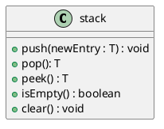

# Stacks

> **Metaphor**: A stack of dishes.
> - Last dish you put on the stack will be the first you can take out

**Stacks**:
- Add items to the top of stack.
- Remove items from the top of the stack.
- **LIFO**: Last In, First Out.
	- *Ex: The last dish you add to the stack will be the first one you take out.*
- **Contents** (Data): Collection of objects in reverse chronological order and having the same data type.

> **Note**: *"The most important ADT in computer science"*
> - We wouldn't have methods or recursion without stacks!

## Specification

| Pseudocode | Description                                               |
|------------|-----------------------------------------------------------|
| push       | Adds a mew entry to the top of the stack                  |
| pop        | Removes and returns the stack's top entry                 |
| peek       | Retirees the stack's top entry without changing the stack |
| isEmpty    | Detects whether the stack is empty                        |
| clear      | Removes all entries from the stack                        |



> **Note**: You shouldn't be able to see anything except the top element.
> - This means no `toArray`!

> **Example**: Stack interface
> ```java
> public interface StackInterface<T> {
> 	void push(T newEntry);
> 	T pop();
> 	T peek();
> 	boolean isEmpty();
> 	void clear();
> }
> ```

## Design Decision

Case: Stack is empty, what to do with `pop` and `peak`?
1. Assume it isn't empty
2. Return `null`
3. Throw an exception.

**Security Note**:
- Don't trust client to use public methods correctly
- Avoid ambiguous return values
- Prefer throwing exceptions rather than returning values to indicate problems.

## Processing Algebraic Expressions

**Notation**:
- **Infix**: Each binary operator appears between its operations
- **Prefix**: Each binary operator appears before its operands
- **Postfix**: Each binary operator appears after is operands
	* *aka: Reverse Polish Notation*

> **Example**: The same expression in infix, prefix, and postfix
> ```
> # Infix
> a + b
> # Prefix
> + a b
> # Postfix
> a b +
> ```

> **Example**: The same expression in infix, prefix, and postfix
> ```
> # Infix
> a + b / c 
> # Prefix
> + a / b c
> # Postfix
> a b c / +
> ```

> **Note**: Keep terms on their original sides when converting expressions (don't use the associative rule).

> **Example**: Checking if an expression is balanced with a stack
> - **Q**: How do you tell if an infix expression has matching brackets and parenthesis?
> 	* *aka: Balanced expression*
> - **A**: Read file sequentially:
> 	1. Push each opening symbol (e.g., `[`, `{`) to the stack as you read it
> 	2. Pop each closing symbol (e.g., `]`, `}`) from the stack as you read it
> 		- If the return value of the pop doesn't match the closing symbol, the expression is unbalanced
> 	3. When you reach the end of the expression:
> 		1. If the stack isn't empty, the expression is unbalanced
> 		2. If the stack is empty, the expression is balanced.

> **Example**: Infix $\to$ Postfix with a stack
> 
> > **How**: We'll read the expression character-by-character and use a stack to maintain a list of operators:
> > - We [add operator(s) from the stack to the postfix expression]{.underline} when we're:
> > 	1. Add the **end of the expression**, or
> > 	2. **When a new operator has lower-or-equal precedence** to the one on the top of the stack.
> >		- *(A closing parenthesis will pop everything off the stack until you reach the opening parenthesis)*
> > - Operands (e.g., `a`, `b`, `c`) get appended to the postfix form when we read them.
> 
> 1. Infix Expression: $a + b * c$
> 
> | Current Character | Postfix Form | Operator Stack |
> |-------------------|--------------|----------------|
> | $a$               | $a$          |                |
> | $+$               | $a$          | $+$            |
> | $b$               | $ab$         | $+$            |
> | $*$               | $ab$         | $+*$           |
> | $c$               | $abc$        | $+*$           |
> |                   | $abc*$       | $+$            |
> |                   | $abc*+$      |                |
> 
> 2. Infix Expression: $a - b + c$
> 
> | Current Character | Postfix Form | Operator Stack |
> |-------------------|--------------|----------------|
> | $a$               | $a$          |                |
> | $-$               | $a$          | $-$            |
> | $b$               | $ab$         | $-$            |
> | $+$               | $ab-$        | $+$            |
> | $c$               | $ab-c$       | $+$            |
> |                   | $ab-c+$      |                |
> 
> 3. Infix Expression: $a^{b^c}$
> 
> | Current Character | Postfix Form | Operator Stack |
> |-------------------|--------------|----------------|
> | a                 | a            |                |
> | ^                 | a            | ^              |
> | b                 | ab           |                |
> | ^                 | ab^          | ^              |
> | c                 | ab^c         | ^              |
> |                   | ab^c^        |                |
> 
> 4. Infix Expression: $a / b * ( c + (d-e))$
> 
> | Current Character | Postfix Form | Operator Stack |
> |-------------------|--------------|----------------|
> | $a$               | $a$          |                |
> | $/$               | $a$          | $/$            |
> | $b$               | $ab$         | $/$            |
> | $*$               | $ab/$        | $*$            |
> | $($               | $ab/$        | $*($           |
> | $c$               | $ab/c$       | $*($           |
> | $+$               | $ab/c$       | $*(+$          |
> | $($               | $ab/c$       | $*(+($         |
> | $d$               | $ab/cd$      | $*(+($         |
> | $-$               | $ab/cd$      | $*(+(-$        |
> | $e$               | $ab/cde$     | $*(+(-$        |
> | $)$               | $ab/cde-$    | $*(+($         |
> | $)$               | $ab/cde-+$   | $*($           |
> | $)$               | $ab/cde-+*$  |                |
>
> > **Note**: When implementing this in code, make sure that the expression is balanced, or throw an exception when something illegal happens.

> **Example**: Evaluating postfix expressions
> ```pseudocode
> Algorithm evaluatePostfix(postfix) {
> 	valueStack = a new empty stack;
> 	while (postfix has chars to parse) {
> 		nextCharacter = next nonblance char
> 		switch (nextCharacter) {
> 			case variable:
> 				valueStack.push(nextCharacter)
> 				break;
> 			case operand: // e.g., +, -, /, ^
> 				operandTwo = valueStack.pop()
> 				operandOne - valueStack.pop()
> 				result = the result o the operation in nextCharacters and its operands operandOne and operandTwo
> 				valueStack.push(result)
> 				break;
> 		}
> 	}
> }
> ```
