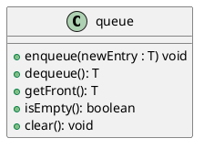
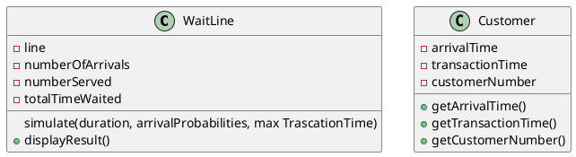
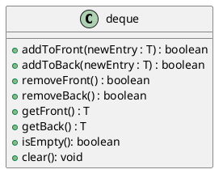

# A. Queue

**Queue**: Entries organized first-in, first-out (**FIFO**)
- *Metaphor: Waiting in line at a store*
- Used in OS and to simulate real-world events
	* Comes into play whenever processes or events must wait.
- **Data**: Collection of objects in chronological order.

> **Example**: OS Task Queue
> - Programs are executed off a task queue

**Terminology**
- First item added is at the front of the queue.
- Item added most-recently is at the back of the queue
	* Additions to the queue always occur at its back.
	
## Specification 



| Pseudocode | Description                                                  |
|------------|--------------------------------------------------------------|
| enqueue    | Adds a new entry to the back of the queue                    |
| dequeue    | Removes and returns the entry at the front of the queue      |
| getFront   | Retrieves the queue's front entry without changing the queue |
| isEmpty    | Detects whether the queue is empty                           |
| clear      | Removes all entries from the queue                           |

> **Note**: Improving performance in implementation
> - If you keep references to the first and last nodes, you can make additions and removals take $O(1)$.

> **Remember**: Client can [only]{.underline} see and remove the entry at the [front of the queue]{.underline}!

> **Example**: Queue Interface
> ```java
> public interface QueueInterface<T> {
> 	void enqueue(T: newEntry);
> 	T dequeue();
> 	T getFront();
> 	boolean isEmpty();
> 	void clear();
> }
> ```

## Simulating a Waiting Line (CRC)

**Responsibilities**: 
- Simulate customers entering and leaving a waiting line
- Display number served, total wait time; average wait time, and number left in line

**Collaboration**:
- Customer



> **Remember**: Random Number Generation
> - We can generate a floating-point between 0—1.
>	- So, to pick something 80% of the time, we simply check if the random number is $\le 0.8$

## Java Class Library: The Interface `Queue`

Methods:
- `add()`
- `offer()`
	* Like add, but doesn't generate exception.
- `remove()`
- `poll()`
	* Like remove, but doesn't generate exception if queue empty.
- `element()`
- `peek()`
- `isEmpty()`
- `size()`

## Java Class Library: The Class AbstractQueue

```java
boolean add(T newEntry);
boolean offer(T newEntry);
T remove();
T poll();
T element();
T peek();
void isEmpty();
int clearSize();
```

# B. Deque

**Deque**: Double-ended queue.
- *Pronounced: "Deck"*
- Has queue-like and stack-like operations.
- You can add to and from the front and back, but not the middle.

> **Example**:
> - Deque is used in the real-world to provide undo functionality.

> **Example**: Private Node inner-class with next and previous pointers
> ```java
> private class Node<T> {
> 	private T data;
> 	private Node next;
> 	private Node prev;
> 	private Node (T data) {
> 		this(data, null, null)
> 	}
> 	private Node (T data, Node next, Node prev) {
> 		this.data = data;
> 		this.next = next;
> 		this.prev = prev;
> 	}
> }
> ```

## Specification



> **Example**: Interface
> ```java
> public interface DequeInterface<T> {
> 	boolean addToFront(T newEntry);
> 	boolean addToBack(T newEntry);
> 	boolean removeFront();
> 	boolean removeBack();
> 	T getFront();
> 	T getBack();
> 	boolean isEmpty();
> 	void clear();
> 
> }
> ```

## Java Class Library: The Interface `Queue`

Methods:
- `addFirst`, `offerFirst`
- `addLast`, `offerLast`
- `removeFirst`, `pollFirst`
- `removeLast`, `pollLast`
- `getFirst`, `peekFirst`
- `getLast`, `peekLast`
- `isEmpty`, `clear`, `size`
- `push`, `pop`

## Java Class Library: The Class `ArrayDeque`

- Implements the interface Deque with an array.
- **Constructors**:
	* `ArrayDeque()`
	* `ArrayDeque(int initialCapacity)`

> **Note**: A better data structure to implement the deque would be a doubly-linked list.

# C. Priority Queues

**Priority Queue**: Organizes objects according to their priorities.
- *Metaphor: Triage in a hospital*
- If all items being added have the same priority, the queue behaves like **FIFO**.

> **Note**: The definition of "priority" depends on the nature of the items in the queue.

> **Note**: Well be using priority queue (and other ADTs) for the final project (implementing [Dijkstra's algorithm](https://wikipedia.org/wiki/Dijkstra%27s_algorithm))

> **Example**: Priority Queue Interface
> ```java
> public interface PriorityQueueInterface<T> extends Comparable<? super T> {
> 	void add(T newEntry);
> 	T remove();
> 	T peek();
> 	boolean isEmpty();
> 	int getSize();
> 	void clear();
> }
> ```
> - Note: `Comparable<? super T>`{.java}
>	- Means that we want the generic object (or its super class) to implement the `Comparable` method.

> **Example**: Priority queue based on lexical graphical order
> 
> ```java
> PriorityQueueInterface<String> myQueue = newLinkedPriorityQueue<>();
> myQueue.add("Jane");
> myQueue.add("Jess");
> myQueue.add("Jill");
> myQueue.add("Jim");
> myQueue.remove();
> // Remaining Entries:
> // Jess
> // Jill
> // Jim
> ```

## Java Class Library: The Class Priority Queue

Methods:
- `add`
- `offer`
- `remove`
- `poll`
- `element`
- `peek`
- `isEmpty`
- `clear`
- `size`

> **Note**: Uses a heap.

# Implementations

## A. Queue

**(Singly) Linked Implementation**:
- Keep two reference variables (to head and tail) to let us add items at the front and remove items from the back at $O(1)$
	* We *enqueue* (add) to the tail.
	* We *deque* (remove) at the head.
- **Special Case:** Remember that if we *deque* a queue [with only one node]{.underline}, we must set both head and tail to `null`.

**Circular Array Implementation**:
- **Circular Array**: When we get to the end of the array, we wrap around to index 1.
- We maintain three variables:
	1. `frontIndex`: Where we enqueue
	2. `backIndex`: Where we dequeue
	3. `count`: Keeps track of how many entries we have.
		- Makes operations like `isEmpty` much easier.
		- Once the `count` is equal to the array's length, the queue is full.
		- Alternatively, you could always keep one entry empty and use it to keep track of the size.
- This is how you achieve a high-performance queue.
- We use modulo (`%`) to find indices.

> **Remember**: A queue is not a bag, it's not supposed to be used for storage, we use it because we want to take things out.
> - *tl;dr We use a queue when we have a *producer* and *consumer* of data (e.g., keyboard input).*

**Circular Linked Implementation**:
- **Circular Linked List**: Previous nodes that have been dequeued are reused for the next enqueue.
	* If there are no unused nodes left, we'll add a new node
	* The tail points to the head.

## B. Deque

**Doubly-Linked Implementation**:
- **Double-Linked List**: Each node points to the `next` node and `previous` node.
	* This allows us to remove and add from the head and tail.
	* Unlinking a node in doubly-linked list is $O(1)$ because we don't need to perform any traversal to get the next or previous nodes.
- Useful for implementing priority queue.

## C. Priority Queue

One way to implement a priority queue is to use an array of queue.
