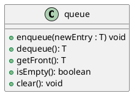

# Queue

**Queue**: Entries organized first-in, first-out (**FIFO**)
- *Metaphor: Waiting in line at a store*
- Used in OS and to simulate real-world events
	* Comes into play whenever processes or events must wait.
- Client can [only]{.underline} see and remove the entry at the [front of the queue]{.underline}.
- **Data**: Collection of objects in chronological order.

> **Example**: OS Task Queue
> - Programs are executed off a task queue

**Terminology**
- First item added is at the front of the queue.
- Item added most-recently is at the back of the queue
	* Additions to the queue always occur at its back.
	
## Specification 

| Pseudocode | Description                                                  |
|------------|--------------------------------------------------------------|
| enqueue    | Adds a new entry to the back of the queue                    |
| dequeue    | Removes and returns the entry at the front of the queue      |
| getFront   | Retrieves the queue's front entry without changing the queue |
| isEmpty    | Detects whether the queue is empty                           |
| clear      | Removes all entries from the queue                           |

> **Note**: Improving performance in implementation
> - If you keep references to the first and last nodes, you can make additions and removals take $O(1)$.

# Deques

# Priority Queues

