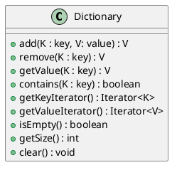

# Dictionary

**Dictionary**: Organize data as key-value pairs $(k,v)$.
- Each entry contains **k**eyword (search key) and **v**alue.
- Aka: Map, Table, Parallel/Associative Array
- *Metaphor: Looking up the definition of a word in a dictionary*

## Specification



| Pseudocode       | Definition                                                                                                                                          |
|------------------|-----------------------------------------------------------------------------------------------------------------------------------------------------|
| add              | Add k,v pair. Returns `null` if new entry was added. If an entry with the same key already exists, it'll replace the pair and return the old value. |
| remove           | Remove an entry by its key. Returns value of removed pair, or `null` if key wasn't found.                                          |
| getValue         | Get the value at a key                                                                                                                              |
| contains         | Check whether the dictionary contains a key                                                                                                         |
| getKeyIterator   | Returns key iterator                                                                                                                                |
| getValueIterator | Returns value iterator                                                                                                                              |
| isEmpty          | Gets whether dictionary is empty                                                                                                                    |
| getSize          | Gets number of entries in dictionary                                                                                                                |
| clear            | Removes all entries from dictionary                                                                                                                 |

> **Limitations**: This specification cannot support null keys or values.

> **Performance Note**: 
> - As `getValue` performs a search, if you want to efficiently iterate through all keys *and* words, you can use an iterator for key and value and use them in parallel.
>	- *(Don't use getValue in an iterator!)*
> - Using the right data structure for the key can improve performance.
>	- e.g., Comparing integer keys is faster than string comparison, and it uses less memory.
> - Using a binary tree structure makes addition $O(\log n)$, but makes search $O(\log n)$

> **Example**: Dictionary Interface
> ```java
> public interface DictionaryInterface<K,V> {
> 	V add(K key, V value);
> 	V remove(K key);
> 	V getValue(K key);
> 	boolean contains(K key);
>	Iterator<K> getKeyIterator();
> 	Iterator<V> getValueIterator();
> 	boolean isEmpty();
> 	int getSize();
> 	void clear();
> }
> ```

> **Example**: Using dictionary for telephone directory
> 
> ```plantuml
> @startuml
> class TelephoneDirectory {
> 	-phonebook
> 	+readFile(data)
> 	+getPhoneNumber(name)
> }
> class Dictionary {
> 	(store as <Name,String> pairs)
> }
> class Name {
>	(provide methods to work with names)
> }
> TelephoneDirectory -> Dictionary 
> Dictionary -> Name
> @enduml
> ```

> **Example**: Word Concordance and Count
> 1. **Word Count**
> - You could also use a dictionary to count the frequency of every word in a text
> 	* The naive implementation is to store `<word,frequency>` pairs as `<String,Integer>` pairs.
> 		- However, the primitive wrapper classes are immutable and wrapping and unwrapping values is very inefficient.
> 	* [A better solution is to create our own class to store a mutable int.]{.underline}
> 2. **Word Concordance**
> - To keep track of the line numbers where each word occurred, we can instead keep a dictionary of `<String, ListWithIterator<Integer>>` pairs

## Java Class Library: The Interface `Map`

```java
V put(K key, V value);
V remove(Object key);
V get(Object key);
boolean containsKey(Object key);
boolean containsKey(Object value);
Set<K> keySet();
Collection<V> values();
boolean isEmpty();
int size();
void clear();
```

# Implementation

## Array-Based

a. You could use array of objects, where each object encapsulates a key and value pair.

> **Example**: The sort of wacky casting you need to do to create an generic array of Entry objects that take a key,value pair
> ```java
> @SuppressWarnings("unchecked")
> Entry<K,V>[] tempDictionary = (Entry<K,V>[]) new Entry[initialCapacity]
> this.dictionary = tempDictionary
> ```

> **Example**: An inner-class to store key,value pairs
> ```java
> private class Entry<K,V> {
> 	private K key;
> 	private V value;
> 	private Entry(K key, V value) {
> 		this.key = key;
> 		this.value = value;
> 	}
> 	/** etc... */
> }
> ```
> 
> > **Note**: To create a new Entry, do `new Entry<>(key, value);`—Java will figure the contents of the square brackets by itself.
<!--*-->

b. Or, you could use two arrays in parallel, one array for key and another array for value.
	- *aka: Associative array*

> **Note**: If your arrays are unsorted, every single operation (addition, removal, retrieval, traversal) will take $O(n)$
> - Improving search will improve major operations.
>	- We can make searches take $O(1)$ using hashing.

> **On Sorting Arrays**: If you sort on-the-go (by ensuring that you maintain order while adding and removing), you'll still be shifting data around.
> - And, at the end of the day, addition, removal, and traversal will still take $O(n)$, but retrieval will be $O (\log n)$
>	- However, we usually only care about retrieval, anyway.

## Linked List

a. You can use a linked list, where each node's data is a key,value pair
b. You could also use two linked lists, one list for keys and another for values.
	- This is wacky.
c. Or, we could have each node have two data fields, one for key and another for value.

> **Note**: Despite this an unsorted linked dictionary will still have addition, removal, retrieval, and traversal take $O(n)$.

> **On Sorting Linked List**: 
> - Despite this, a sorted linked dictionary will still have addition, removal, retrieval, and traversal take $O(n)$.
> 
> > **Example**: Private key-value node inner class
> > ```java
> private class Node {
> 	private K key;
> 	private V value;
> 	private Node next;
> 	/** etc. */
> }
> > ```
> > - We use the extends syntax to ensure that the keys can be compared (so that we can sort them).
> 
> > **Example**: Header for a sorted linked implementation
> > ```java
> > public class SortedLinkedDictionary<K extends Comparable<? super K>, V> implements DictionaryInterface<K,V>
> > ```
> > - We use extends to ensure that the keys can be compared with `compareTo`{.java} (so that we can sort them).


> **Thus**: A sorted array is the only implementation covered so far that provides better performance.
> - Hashing, however, allows us to have $O(1)$ searching, by turning keys into numeric values that can be used as indices.
