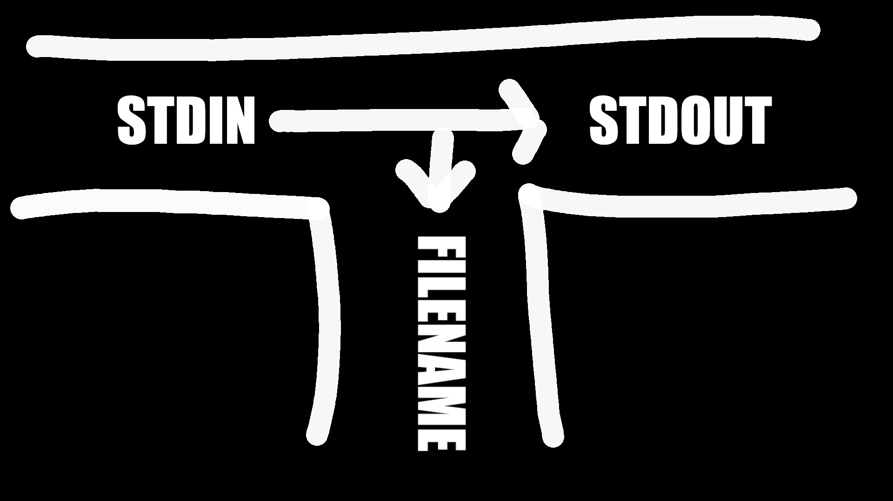

# Pipes

**General Idea for Pipes in UNIX**:
- The output of one program is the input of the other, and vice versa.
- Both programs run at the same time.
- Often, only one end of the pipe is used.

**Bad/Naive Approach**: Using Files
- Idea: Save output of first program to a file, use file as input for the second program.
- Why It's Bad:
	* Slower.
	* Unnecessary use of disk.
	* No multitasking.

**Design Philosophy of Pipes**:
- Goal: Achieve complex tasks by combining individual utilities
- Pipes are usually chained together (redirection)
- Pipes follow the FIFO (first in, first out) mechanic
- Pipes can have multiple readers and writers
- Pipes are used to redirect the `stdout` of out one command to the `stdin` of another.
- If a process...:
	1. ... tries to read data but nothing is available, UNIX puts the reader to sleep until data is available.
	2. ... can't keep up reading from the process that's writing, the unread data goes into a buffer until it is read (**pipe size**).
		* If the pipe is filled up, UNIX will put the writer to sleep while the reader frees up space.

> **Examples**: Using pipes
> 
> ```bash
> # Count number of lines the who command returned
> who | wc -l
> # Search for all entries in world file for net-im packages
> cat /var/lib/portage/world | grep "net-im/"
> # Sort list of users
> who | sort
> ```

> **Beginner Mistake**: `|` v.s. `>`
> 
> Don't confuse pipes and redirection!
> - Pipes are a UNIX feature for creating data pipelines between processes,
> - Redirection is a shell feature for writing the output of processes into files.

# Filters

**Filters**: Class of UNIX utilities that read from standard input, transform the file, and write to standard out.
- Filters can be thought of as *data-oriented programming*.
- Each step of the computation transforms data *stream*.
- Text processing commands are often implemented as filters.
- Users can use file redirection and pipes to set up `stdin` and `stdout` how they want.
- **Filters don't modify the original file**, they output the modified data into `stdout`
	* e.g., `sort file.txt` doesn't modify the contents of `file.txt`.

# Popular UNIX Filters

- `cat`: Read lines from `stdin` (and more files), and concatenate them to `stdout`.
- `more/less`: Read lines from `stdin`, and provide a paginated view to `stdout`.
- `head`: Read the first few lines from `stdin` (and more files) and print them to `stdout`.
- `tail`: Read the last few lines from `stdin` (and more files) and print them to `stdout`.
- `tee`: Copy `stdin` to `stdout` and one or more files
- `cut`: Cut specified byte, character or field from each line of `stdin` and print to `stdout`.
- `paste`: Read lines from `stdin` (and more files), and paste them together line-by-line to `stdout`.
- `wc`: Read from `stdin`, and print the number of newlines, words, and bytes to `stdout`.
- `tr`: Translate or delete characters read from `stdin` and print to `stdout`.
- `sort`: Sort the lines in `stdin`, and print the result to `stdout`.
- ``uniq``: Read from `stdin` and print unique (that are different from the adjacent line) to `stdout`.
- `grep`: Find lines in `stdin` that match a pattern and print them to `stdout`.
- `sed`: Streamline Editor used to edit text in non interactive mode.
- `awk`: Powerful editing tool for files with programming features

> **More on `cat`**
> 
> `cat` copies its input to output unchanged (identity filter). When supplied a list of file names, it con[cat]{.underline}enates them onto `stdout`.
> 
> Some Options (Flags):
> - `-n`: Number output lines starting from 1.
> - `-v`: Display control-characters in visible form (e.g., `^M`)

> **More on `more`**
> 
> `more` is like `cat`, except it displays content page-by-page.
> - Example: `more +4 foo.txt` displays file content starting at line 4. 

> **More on `less`**
> 
> `less` lets you view the contents of a file similarly to `more`, except it doesn't load the entire file at once.
> - `less` is faster than `more` and has a larger number of features. 

> **More on `head` and `tail`**
> 
> `head` displays the first few lines of a file.
> 
> > **Format**: `head [-n] [filename...]`
> - `-n`: Number of lines to display (default: 10)
> - filename: List of filenames to display
> 	* When more than one filename is given, start of each listing begins with `==>filename<==`.
> 
> ---
> 
> `tail` displays the last few lines of a file.
> 
> > **Format**: `tail -number [rbc] [f] [filename]`
> - `-number`: Number of lines to display (default: 10)
> - `b,c`: Units of lines/blocks/characters
> - `r`: Print ins reverse order (lines only)
>
> ---
> 
> **Example**: Using `head` and `tail` to get lines 4—10 of a file
> 
> ```bash
> tail -n +4 patch.sh | head -n 6
> ```

> **More on `wc`**
> 
> `wc` counts the number of lines, characters, or words.
> - By default, prints number of all three.
> 
> Options:
> - `-l`: Count lines
> - `-w`: Count words
> - `-c`: Count characters

> **More on `tee`**
>
> <center>
> [](.images/tee.png "Drawing demonstrating tee")
> </center>
> 
> `tee` copies `stdin` to `stdout` for one or more files.
> - Captures intermediate results from a filter in the pipeline.
> - Remember, pipes can have multiple readers and writers!
> 
> > **Format**: `tee [ -ai ] file-list`
> - `-a`: append to output file rather than overwrite, default is to overwrite (replace) the output file
> - `-i`: ignore interrupts
> - `file-list`: one or more file names for capturing output
> 
> > **Example**: Using `tee` to store the state of a pipe
> > ```bash
> > ls | head -10 | tee first_10.txt | tail -5
> > ```
> > - This line prints to `stdout` the last five lines (`tail -5`) of the first 10 lines (`head -10`) in `ls`.
> > 	* It also captures the result of pipe after doing `head -10` and stores it in `first_10.txt`

> **More on `cut`**
> 
> > **Note**: Delimited data
> > - Data can be delimited by a variety of symbols (e.g., tabs, bars, colons). When using `cut`, make sure you're using the right delimiter!
> 
> `cut` prints selected parts of input lines.
> - Can select columns
> - Can select a range of character positions
> 
> Options:
> - `-f listOfCols`: print only the specified columns on output
> 	* Can be given as range (e.g., `1-5`) or comma-separated (e.g., `1,3,4,5`)
> - `-c listOfPos`: print only chars in the specified positions
> 	* Can be given as range (e.g., `1-5`) or comma-separated (e.g., `1,3,4,5`)
> - `-d c`: use character `c` as the column separator
> 	* Defaults to `<tab>`
> 
> > **Example**: Using `cut`
> > ```bash
> > $ cat /etc/passwd | cut -d: -f1
> > ```
> > - Print the first column of the `/etc/passwd` file (only usernames)
> > 
> > ```bash
> > $ cat /etc/passwd | cut -d: -f1,7
> > ```
> > - Print the first and last column of the `/etc/passwd` file (username and default shell)
> >	- Note how there's no way to refer to the last column without counting the columns. 

> **More on `paste`**
> 
> `paste` displays several text file "in parallel" on output.
> - If the inputs are files $\varphi, $\varsigma$, and $\upsilon$:
> 	* Line 1 will be composed of the first line of $\varphi, first line of $\varsigma$, and first line of $\upsilon$.
> 	* Line 2 will be composed of the second line of $\varphi, second line of $\varsigma$, and second line of $\upsilon$.
> 	* etc.
> - Lines from each file are separated by a tab character.
> - If files are different lengths the output will have all the lines from the longest file, missing lines will have empty strings.
> 
> > **Example**: Using `paste`
> > 
> > Suppose we have the following files:
> > ```txt
> > a.txt
> > ---
> > 1
> > 2
> > ```
> > 
> > ```txt
> > b.txt
> > ---
> > 3
> > 4
> > ```
> > 
> > ```txt
> > c.txt
> > ---
> > 5
> > 6
> > ```
> > 
> > ```bash
> > $ paste a.txt b.txt c.txt
> > 1       3       5
> > 2       4       6
> > ```
> 
> > **Example**: Using `paste` to reverse a `cut`
> > 
> > ```bash
> > (cut -f1 -d: < /etc/passwd) > 0_usernames.txt
> > (cut -f2 -d: < /etc/passwd) > 1_encrypted_password.txt
> > (cut -f3 -d: < /etc/passwd) > 2_uid.txt
> > (cut -f4 -d: < /etc/passwd) > 3_gid.txt
> > (cut -f5 -d: < /etc/passwd) > 4_fullname.txt
> > (cut -f6 -d: < /etc/passwd) > 5_homedir.txt
> > (cut -f7 -d: < /etc/passwd) > 6_loginshell.txt
> > ```
> > - Cut the /etc/passwd file into seven files.
> > 
> > ```bash
> > paste -d: 0_usernames.txt 1_encrypted_password.txt 2_uid.txt 3_gid.txt 4_fullname.txt 5_homedir.txt 6_loginshell.txt
> > ```
> > - Perfectly reconstruct the `/etc/passwd` file from its `cut` components.

> **More on `tr` ([tr]{.underline}anslating strings)**
> 
> `tr` copies `stdin` to `stdout` with substitution or deletion of selected characters.
> - Reads from `stdin`
> 
> > **Format**: `tr [-cds] [string1] [string2]`
> - `-d`: delete all input characters contained in string1
> - `-c`: complements the characters in string1 with respect to the entire ASCII character set
> - `-s`: squeeze all strings of repeated output characters in the last operand to single characters
> - `[string1]` and `[string2]`:  Any character that matches a character in `string1` is translated into the corresponding character ins `string2`.
> 	- Any character that doesn't match a character in `string1` is passed to `stdout` unchanged.
> 
> > **Examples**:
> > ```bash
> > # Replace all instances of s with z
> > tr s z
> > ```
> > ```bash
> > # Replaces all instances of s with z and o with x
> > tr so zx
> > ```
> > ```bash
> > # Replaces all lower-case characters with upper-case characters
> > tr a-z A-Z
> > ```
> > ```bash
> > # Deletes all a-c characters
> > tr –d a-c
> > ```
> > ```bash
> > # Change delimiter of /etc/passwd
> > tr ‘:’ ‘|’ /etc/passwd
> > ```
> > ```bash
> > # Change text from upper to lower case
> > cat lowercase.txt | tr '[A-Z]' '[a-z]' > uppercase.txt
> > # Change text from upper to lower case using named character classes
> > cat lowercase.txt | tr [:upper:] [:lower:]  > uppercase.txt
> > ```
> > ```bash
> > # Import DOS files
> > tr –d ’\r’ < dos_file.txt
> > ```
> 
> > **Remember**: `tr` translates strings character-by-character, it doesn't substitute string-by-string.

> **More on `sort`**
> 
> > **Format**: `sort [-dftnr] [-o filename] [filename(s)]`
> - `-d`: Dictionary order, only letters, digits, and whitespace are significant in determining sort order
> - `-f`: Ignore case (fold into lower case)
> - `-t`: Specify delimiter
> - `-n`: Numeric order, sort by arithmetic value instead of first digit
> - `-r`: Sort in reverse order
> - `-t`: delimiter character
> - `-k`: column
> - `-o`: filename - write output to filename, filename can be the same as one of the
> input files
> 
> > **Examples**:
> > ```bash
> > sort -t: -nk2 /etc/passwd
> > ```
> > - Sort the `/etc/passwd` file numerically (`-n`), by uid (`-k2`), using the ":" character as the field separator (`-t:`).
> > 
> > ```bash
> > sort -t: -nrk3 /etc/passwd
> > ```
> > - Sort the `/etc/passwd` file numerically (`-n`), by gid (`-k3`), using the ":" character as the field separator (`-t:`), in reverse order (`-r`)

> **More on `uniq` (list unique items)**:\
>
> `uniq` removes or reports *adjacent* duplicate lines.
> - Tip: Use `sort` to make all duplicate lines adjacent.
> 
> > **Format**: `uniq [-cduif] [input-file] [output-file]`
> - `-c`: Precede each output line with the number of time the line occurred in input.
> - `-d`: Only output lines that were repeated.
> - `-u`: Only output lines that were unique.
> - `-i`: Case insensitive comparison
> - `-f [num]`: Ignore first `[num]` fields in each input line.
> 	* **Field**: String a non-blank characters separated from adjacent fields by blanks.
> - `-s [chars]`: Ignore first `[chars]` characters in each input line.

> **More on `find` (apply expressions to files)**:\
> 
> > **Format**: `find [pathlist] [expression]`
> - `[pathlist]`: Recursively descends through this path, applying `[expression]` to every file.
> - `[expression]`: Expression that gets applied to every file
>	- **Expressions**:
>		* `-name pattern`
>			+ Find files where the pattern returned `true`.
>				- e.g., `-name '*.c'`
>		* `-type ch`
>			+ Find files of type (`ch` `c`: character, `b`: block, `f` plain file, etc.)
>				+ e.g., `find ~ -type f`
>		* `-perm[+-]mode`
>			+ Find files with given access mode (given in octal mode)
>				+ e.g., `find . -perm 755`
>		* `-user uid/username`
>			+ Find files by owner *uid* or *username*
>		* `-group guid/groupname`
>			+ Find files by group *guid* or *groupname*
>		* `-size size`
>			+ Find files by `size`.
>		* *etc...*
>	- **Logical Operations**:
>		- `!`: Returns logical negation of expression
>		- `op1 -a op2`: Matches patterns `op1` and `op2`
>		- `op1 -o op2`: Matches patterns `op1` or `op2`
>		- `()`: Group expressions together
>	- **Actions**:
>		* `-print`: Prints out name of the current file (default)
>		* `-exec cmd`: Executes `cmd` (must be terminated by an escaped semicolon.
>			+ If you specify `{}` as an argument, it will be replaced by the name of the current file.
>			+ Executes once per file
>			+ e.g., `find /tmp -name "*.pdf" -exec rm "{}" ";"`
> 
> > **Examples**:
> > ```bash
> > # Print all png files in my documents folder
> > find ~/Pictures -name '*.png'
> > # Delete all pdf files in my /tmp folder
> > find /tmp -name "*.pdf" -exec rm "{}" ";"
> > # Print all files in my videos folder larger than 500MiB
> > find ~/Videos -size +500M -print
> > # Print all config files modified in the last day
> > find ~/.config -mtime 1
> > # Count words of all config files modified in the last day
> > find ~/.config -mtime 1 -exec wc -w {} \;
> > ```
> > - Note how the `*` is being escaped to suppress shell interpretation. 

