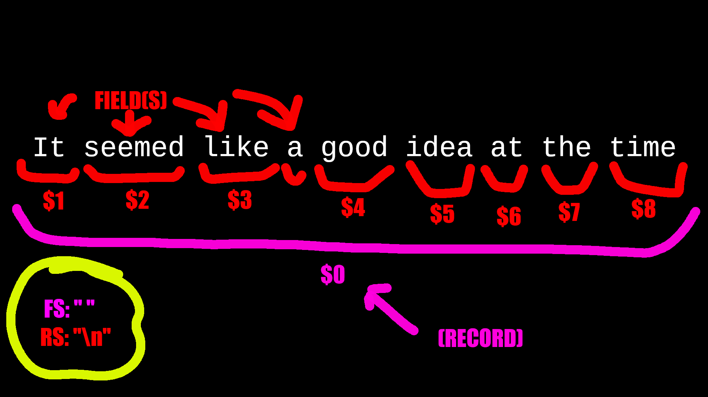

# `awk`

> *"It seemed like a good idea at the time."*\
> *— Brian Kernighan*

`awk`: General purpose programmable filter that handles text as easily as numbers,
- One of the most powerful UNIX utilities.
	* Common data manipulation can be done with few lines of code.
- Processes fields (parts of lines)
- Looks a little like C, but automatically handles input, field splitting, initialization, and memory management.
	* Built-in string and number types.
	* No variable type declarations.
	* Great for iterative prototyping.
	* Is a *pattern-action* language, like `sed`.

> **`awk` v.s. `sed`**:
> - `awk` can process fields of text.
> 	* `sed` can only process things line-by-line. 
> - Convenient numeric processing.
> - Variables and control flow in the actions.
> - Convenient way of accessing fields within the lines.
> - Flexible printing.
> - Built-in arithmetic and string functions.
> - C-like syntax.

> **Running `awk`**:
> 1. `awk 'program' inputfile(s)`, or
> 2. `awk 'program'`, or
> 3. `awk -f program_file inputfile(s)`
> 
> > **Examples**: Running `awk` 
> > ```bash
> > # Files
> > $ awk 'program' input-file1 input-file2 ...
> > $ awk -f program-file input-file1 input-file2 ...
> > # Redirection and pipes
> > $ ls | awk ‘program’ > foo
> > # Stdin
> > $ awk 'program'
> > ```
> > - The `-f` flag is useful because it lets us save large programs to their own files rather than making large multi-line shell commands.

> **Etymology**: Named after inventors (Aho, Weinberge, Kernighan)

> **Variants**:
> - `nawk`: New awk, the new standard for `awk`
> 	* Designed to facilitate large awk programs
> - `gawk`: Free `nawk` clone from GNU.
>	- On Linux, `awk` is often aliased to GNU `awk`.

> **Remember**: `awk` is a filter, it doesn't alter input files by itself. 

## Structure of an `awk` Program

> **General Structure of an `awk` Program:**
> ```
> BEGIN {action}
> pattern {action}
> ...
> pattern {action}
> END {action}
> ```

An `awk` program consists of:
1. Optional BEGIN segment
	- Executes before reading input data.
2. *pattern-action* pairs
	- For processing of input data
	- For each pattern matched the corresponding action is taken
3. Optional END segment
	- Executes after end of input data.

# Patterns and Actions

**On Patterns and Actions**:
- `awk` searches a set of files for patterns.
- Actions are performed on lines or fields that contain matching patterns.
- Process one input line at a time.
	* Similar to `sed`.
- Patterns are listed plainly while actions are enclosed in brackets (`{}`).

**Pattern-Action Structure**:
- Every program statement has to have a *pattern*, *action*, or both.
- When `awk` scans a sequence of input *lines* (*records*), it goes through them one-by-one searching for ones that match the pattern. 

> **Default Pattern and Action Behavior**:
> * Default *pattern* is to match all lines.
> * Default *action* is to print to `stdout`.

## Patterns

**Pattern**: Selector that determines whether an *action* should be executed.
- Can be...:
	1. The special token **BEGIN** or **END**
		- **BEGIN**: Actions performed before first input line is read. 
		- **END**: Actions performed after last input has been processed.
	2. A regular expression (enclosed `//`).
		- e.g., `/bazinga/`
	3. A relational or string match expression.
		- e.g., `name == "UNIX Tools"`, `x > 0`, etc.
	4. An arbitrary combination of the above using `&&` and `||`.
		- e.g. `/bazinga/ && (x > 0)`

> **Note**: `!` negates the pattern.

## Actions

**Action**: Performed on every line that matches its respective *pattern*.
- May include a list of one or more C-like statements.
- Can have arithmetic and string operations, assignments, and multiple output streams.
- Must be enclosed in braces to distinguish them from patterns.

> **Example**: An example `awk` command that filters for HTML files from ls.
> ```bash
> ls | awk '
> /\.html$/ { print }
> '
> ```
> - The pattern being used is the `/\.html$/` regex, the action is `{ print }`

# Variables

Two kinds of `awk` variables:
1. **Built-In (predefined)**:
	- *Positional variables* (`$0`, `$1`, `$2`, ..., etc.)
	- *Environmental variables* (`FS`, `OFS`, `RS`, etc.)
2. **User Defined**:
	- User-created variable.

> **Example**: Creating a user-defined variable (prints number of lines in input)
> ```awk
> BEGIN { sum = 0 }
> { sum ++ }
> END { print sum }
> ```

# Operators

> **Important**: All numbers in `awk` are floating-point numbers, expressions like `5/3` won't get truncated into integers!

## Arithmetic Operators

(highest precedence to lowest)
- `x ^ y` or `x ** y`: **Exponentiation**
	- The character sequence ‘`**`’ is equivalent to ‘`^`’.
	- e.g., ‘`2 ^ 3`’ has the value eight; 
- `- x`: **Negation**
- `+ x`: **Unary Plus**
	- The expression is converted to a number.
- `x * y`: **Multiplication**
- `x / y`: **Division**
	- Remember: Division of integer-looking constants produces a real number, not an integer!
		- e.g., ‘`3 / 4`’ has the value `0.75`.
- `x % y`: **Remainder**
- `x + y`: **Addition**
- `x - y`: **Subtraction**

## Concatenation Operator

**Concatenation**: Combines strings.
- This is the only string operation.
- Done by writing expressions next to one another (no operator symbol).

> **Example**: String concatenation
> ```awk
> $ awk BEGIN {
> 	x = "HELLO"
> 	print (x " WORLD")
> }
> HELLO WORLD
> ```

> **Note on Undefined Behavior**: The [order of evaluation of expressions used for concatenation is undefined]{.underline} in the `awk` language, for example—
> ```awk
> BEGIN {
> x = "don’t"
> print (x (x = " panic"))
> }
> ```
> —It's not defined whether the expression `(x = " panic")` is supposed to be evaluated before or after the value of `x` is retrieved to produce the concatenated value.
> - So the result could be "`don't panic`" or "` panic panic`" depending on the `awk` implementation.
>	- Most `awk` implementations will "get it right", but this shouldn't be relied on.
> - Basically, if something goes wrong, you probably need to unintuitively wrap something in parentheses to prevent something from being improperly interpreted.

## Assignment Operator

**Assignment**: Expression that stores a value in a variable.

> **Examples**: Using the assignment operator
> ```awk
> $ awk '
>	BEGIN {
> 	thing = "food"
> 	predicate = "good"
> 	message = "this " thing " is " predicate
> 	print message
> 	foo = 1
> 	foo = foo + 5
> 	print foo
> 	foo = "bar"
> 	print foo
> }
> '
> this food is good
> 6
> bar
> ```

## Increment and Decrement Operators

`++` and `--`: **Increment and Decrement**
- Increase or decrease value of a variable by one.
- Are also assignment operators.
- What they return when you call them differs depending on whether you place the `++` or `--` before or after the variable. (pre v.s. post-increment/decrement)

> **Examples**: Using increment and decrement operators
> 
> ```awk
> x = 3
> x++
> print x
> ```
> - Prints `4`.
> 
> ```awk
> x = 4
> x--
> print x
> ```
> - Prints `3`.

> **Pre-Increment/Decrement (`++x`/`--x`) v.s. Post-Increment/Decrement (`x++`/`x--`)**
> - `++x`: Increment $x$. Returns the new value of $x$ ($x+1$).
> - `--x`: Decrement $x$. Returns the new value of x ($x-1$).
> - `x++`: Increment $x$. Returns the old value of $x$.
> - `x--`: Decrement $x$. Returns the old value of $x$.
> 
> Whether you use pre-or-post increment/decrement doesn't matter unless you're doing wacky stuff like using the return values of the increment and decrement operators (e.g., `print ++x`{.awk} versus `x++; print x`{.awk})
> 	* Another reason to not use the return values of the increment and decrement operators to reduce your LOC by one is that the outcomes of edge cases are implementation-defined (rel: undefined behavior), so you may have off-by-one errors when your gigabrain command (e.g., `print x += ++x + x++`{.awk}) is run on a different version of `awk`.
> 
> > **Examples**: Using the increment operator 
> > 
> > > *"Doctor, it hurts when I do this!*\
> > > *Then don't do that!"*\
> > > *— Groucho Marx*
> > 
> > ```awk
> > x = 5
> > print ++x
> > ```
> > - Prints `6` (demonstrating pre-increment).
> > 
> > ```awk
> > x = 5
> > print x++
> > ```
> > - Prints `5` (demonstrating post-increment).
> > 
> > ```awk
> > x = 6
> > print x += x++
> > ```
> > - May print `12` or `13`, depending on your implementation.

# Environmental Variables

<center>
[](.images/records-and-fields.png "Diagram demonstrating record and field separtion")
</center>

## Records (`RS`, `NR`)

`RS`: Stores the record separator.
- The default *record separator* is the **newline** character.
	* So by default, `awk` processes inputs one line at a time.
		+ However, the record separator can be any other regular expression, changing `awk`'s definition of a "line".
- Can be changed in the **BEGIN** action.

`NR`: Stores the **number of the current record**.
- Increments every time a record is processed.
- Starts counting at zero.
- Is never automatically reset to zero.

> **Examples**: Using `NR` (number of records)
> $ awk ‘
> {
> 	if (NR > 100)
> 	{
> 		print NR, $0;
> 	}
> } ‘
> - Prints all records (lines) after the first 100, prefixed by their original line number.
> 
> $ awk ‘
> {
> 	if (NR % 2 == 0)
> 	{
> 		print NR, $0;
> 	}
> } ‘
> - Prints all records (lines) that are even-numbered, prefixed by their original line number.

## Fields (`FS`, `NF`, Positional Variables, `OFS`, `ORS`)

`FS`: Stores the **field separator**. Can be multiple characters.
- e.g., if `FS=":"`{.awk}, then `awk` will split a line into fields whenever it sees the `:` symbol.
- The default *field separator* is whitespace.
	* Each line is split into fields.
		+ You can access fields through *positional variables*.
- You can also use the `-F` option to set the field separator through a command-line flag, but it can only be a single character.
	* In `awk` script, however, not only can you use multiple-character field separators, but you can even change the field separator (at most once per line)

`NF`: Stores the **number of fields**.

`$`*digit*: **Positional variable** that lets you access fields.
- `$0`: The entire line.
- `$1`: The first field.
- `$2`: The second field.
- `$3`: The third field.
- `$`...: etc.

> **Note**: A positional variable isn't a special variable, but a function triggered by the dollar sign.

`OFS`: Stores the **output field separator**.
- The default *output field separator* is a space.
	* When the `print` command is used with commas like `{ print $1, $3 }`, the output gets separated by the output field separator when printed.

`ORS`: Stores the **output record separator**.
- The default *output record separator* is a newline.

> **Example**: Changing the field splitter
> 
> ```bash
> $ cat file.txt
> ONE 1 I
> TWO 2 II
> #Colons
> THREE:3:III
> FOUR:4:IV
> FIVE:5:V
> #Spaces
> SIX 6 VI
> SEVEN 7 VII
> $ awk '
> ```
> ```awk
> {
>   if ($1 == "#Colons") {
>     FS=":";
>   } else if ($1 == "#Spaces") {
>     FS=" ";
>   } else {
>     print $3
>   }
> }' file.txt
> ```
> ```bash
> I
> II
> III
> IV
> V
> VI
> VII
> ```
> - The script outputs the third field of every line, changing the field splitter as appropriate.
> 	* For the first two lines, the default field splitter is whitespace, so when it falls through the ifs and lands on `print $3`{.awk}, it grabs the third field correctly.
> 	* On line 3, the field splitter is changed to colons (`:`) conditionally by the check for a line whose first field is "`#Colons`" (`if ($1 == "#Colons") {`{.awk})
> 	* Lines 4—5 have their third field get printed by `print $3`{.awk}
> 	* On line 6, the field splitter is conditionally changed to space ("` `") by the check for the line with the first field containing "`#Spaces`".
> 	* Line 7—8 get their third field printed out as expected.

> **Example**: Printing fields and using `OFS`
> 
> > **Recall**: The default pattern is to perform an action on all lines, and the default action is to print to `stdout`.
> > - We often prefer to out the output field separator (e.g., `print $1,$3`{.awk}) instead of using concatenation (e.g., `print $1 " " $3`{.awk}).
> 
> ```awk
> { print }
> ```
> - Print all read input lines to `stdout`.
> 
> ```awk
> { print $0 }
> ```
> - Print all read input lines to `stdout`.
> 	* (Because `$0` is the positional variable for the whole input line.)
> 
> ```awk
> $ awk '
> BEGIN {
>   { print "Hello","World" }
> }'
> Hello World
> ```
> - Print "`Hello World`" with the print command.
> 
> ```awk
> $ awk '
> BEGIN {
>   OFS=", "
>   { print "Hello","World" }
> }'
> Hello, World
> ```
> - Print "`Hello, World`" with the print command by changing the output field separator.

> **Example**: Using output record separator
> 
> ```awk
> BEGIN {
>   ORS="\r\n"
> }
> {
>   print
> } 
> ```
> - This filter adds a carriage return to all lines, before the newline character.

## Misc

`FILENAME`: Stores the name of the file being read.
- Is empty (`""`) if `stdin` or pipes were used to send data to `awk`. 

> **Example**: Using `FILENAME`
> ```awk
> $ awk '
> BEGIN {
>   f = "";
> }
> {
>   if (f != FILENAME) {
>     f = FILENAME
>     print "Now reading:", f
>   }
> }
> ' file.txt file2.txt file3.txt
> Now reading: file.txt 
> Now reading: file2.txt 
> Now reading: file3.txt 
> ```
> - Prints the filename of 
> 	* (We use `f` as a flag to prevent printing this message more than once per file (`if (f != FILENAME)`{.awk}))

# `printf`

> **Format**: `printf(format)`\
> **Format**: `printf(format,argument...)`

`awk` uses the `printf` function to do formatted output like C.

> **Examples**: Using `printf` 
> ```awk
> $ awk '
> {
>   printf("%s\n", $0)
> }
> ' file.txt
> ONE 1 I 
> TWO 2 II 
> #Colons 
> THREE:3:III 
> FOUR:4:IV 
> FIVE:5:V 
> #Spaces 
> SIX 6 VI 
> SEVEN 7 VII
> ```
> - Print each record followed by a newline.
>
> ```awk
> $ awk '
> {
>   printf("%s (hello!) \n", $0)
> }
> ' file.txt
> ONE (hello!) 
> TWO (hello!) 
> #Colons (hello!) 
> THREE:3:III (hello!) 
> FOUR:4:IV (hello!) 
> FIVE:5:V (hello!) 
> #Spaces (hello!) 
> SIX (hello!) 
> SEVEN (hello!) 
> ```
> - Print each record followed by "` (hello!) `" and a newline.

## Format Specifiers

| Specifier | Meaning                                            |
|-----------|----------------------------------------------------|
| `%c`      | ASCII Character                                    |
| `%d`      | Decimal integer                                    |
| `%e`      | Floating Point number (engineering format)         |
| `%f`      | Floating Point number (fixed point format)         |
| `%g`      | The shorter of e or f, with trailing zeros removed |
| `%o`      | Octal                                              |
| `%s`      | String                                             |
| `%x`      | Hexadecimal                                        |
| `%%`      | Literal %                                          |

| Sequence | Description                 |
|----------|-----------------------------|
| \a       | ASCII bell (NAWK/GAWK only) |
| \b       | Backspace                   |
| \f       | Formfeed                    |
| \n       | Newline                     |
| \r       | Carriage Return             |
| \t       | Horizontal tab              |
| \v       | Vertical tab (NAWK only)    |

# Pattern Selection

`awk` patterns are good for selecting specific lies from the input for further processing.

> **Examples**:
> ```awk
> $2 >= 5 { print }
> ```
> - Selection by comparison.
> 
> ```awk
> $2 * $3 > 50 { printf(“%6.2f for %s\n”, $2 * $3, $1) }
> ```
> - Selection by computation.
> 
> ```awk
> $1 == "NYU"
> $2 ~ /NYU/
> ```
> - Selection by text content.
> 
> ```awk
> $2 >= 4 || $3 >= 20
> ```
> - Combinations of patterns
> 
> ```awk
> NR >= 10 && NR <= 20
> ```
> - Selection by line number.

# User-Defined Variables

`awk` variables:
- Take on numeric (floating point) or string values according to context.
- Are unadorned (don't need to be declared).
- Initialized to the null string by default.
	* Has a numerical value of 0.

> **Example**:
> ```awk
> {
> 	HOURS_WORKED = $3
> 	HOURS_WORKED > 15 ( x = x + 1 )
> }
> END { print x, " employees worked more than 15 hours." }
> ```
> - Count number of records where field 3 was larger than 15.
> 
> ```awk
> {
> 	HOURLY_WAGE = $2
> 	HOURS_WORKED = $3
> 	pay += HOURLY_WAGE * HOURS_WORKED 
> }
> END {
> 	print “Employee Statistics:”
> 	print “- Total pay is:”, pay
> 	print “- Average pay is:”, pay/NR
> }
> ```
> - Calculate total and average pay.

# Control Structures

**Overview**:

| Control Statement  | Description                                                                      |
|--------------------|----------------------------------------------------------------------------------|
| If Statement       | Conditionally execute some awk statements.                                       |
| While Statement    | Loop until some condition is satisfied.                                          |
| Do Statement       | Do specified action while looping until some condition is satisfied.             |
| For Statement      | Another looping statement, that provides initialization and increment clauses.   |
| Switch Statement   | Switch/case evaluation for conditional execution of statements based on a value. |
| Break Statement    | Immediately exit the innermost enclosing loop (`for`, `while`, or `do while`).   |
| Continue Statement | Skip to the end of the innermost enclosing loop.                                 |
| Next Statement     | Stop processing the current input record.                                        |
| Nextfile Statement | Stop processing the current file.                                                |
| Exit Statement     | Stop execution of awk.                                                           |

> **More on `if` statement**: (Syntax)
> 
> The `else` keyword needs to either be on its own line—
> 
> ```awk
> x=64
> if (x % 2 == 0)
> 	print "x is even"
> else
> 	print "x is odd"
> ```
> 
> —Or the contents need to be surrounded by braces—
> 
> ```awk
> x=64
> if (x % 2 == 0) {
> 	print "x is even"
> } else {
> 	print "x is odd"
> }
> ```
> 
> —Or a semi-colon must be used to separate the body of the *then* statement from the *else* statement.
> 
> ```awk
> x=64
> if (x % 2 == 0)
> 	print "x is even"; else
> 	print "x is odd"
> ```

> **More on `while` and `do-while`:** (Examples)
> 
> ```awk
> BEGIN {
>         i=1
>         while (i <= 3) {
>                 printf("%s", i)
>                 i++
>         }
> }
> ```
> - Prints `1 2 3 `.
> 
> ```awk
> BEGIN {
> 	i=1
> 	do {
> 		printf("%s ", i)
> 		i++
> 	} while (i <= 10)
> }
> ```
> - Prints `1 2 3 4 5 6 7 8 9 10 `

> **More on `for`: (Examples)**
> 
> ```awk
> BEGIN {
> 	for (i = 1; i <= 3; i++)
> 		printf("%s ", i)
> }
> ```
> - Prints `1 2 3 `
> 
> ```awk
> BEGIN {
> 	for (i = 1; i <= 100; i *= 2)
> 		print i
> }
> ```
> - Prints every even number between 1—100 on a new line.<!--*-->
> 
> ```awk
> for (i in username) {
> 	print username[i], i;
> }
> ```
> - Prints every item in an array.

> **More on `switch`**: Example
> 
> > **Note**: Control flow in switch statements work like they do in C.
> > - One a match to a case is made, the case statement bodies execute until a `break`, `continue`, `next`, `nextfile`, `exit`, or the end of the switch statement itself.
> 
> ```awk
> NR > 1 {
> 	printf "The %s is classified as: ",$1
> 		switch ($1) {
> 			case "apple":
> 				print "a fruit, pome"
> 				break
> 			case "banana":
> 			case "grape":
> 			case "kiwi":
> 				print "a fruit, berry"
> 				break
> 			case "raspberry":
> 				print "a computer, pi"
> 				break
> 			case "plum":
> 				print "a fruit, drupe"
> 				break
> 			case "pineapple":
> 				print "a fruit, fused berries (syncarp)"
> 				break
> 			case "potato":
> 				print "a vegetable, tuber"
> 				break
> 			default:
>				print "[unclassified]"
> 		}
> }
> ```
> - Large switch statement to categorize strings. 

> **More on `break`:** (Example)
> ```awk
> num = $1
> for (divisor = 2; divisor * divisor <= num; divisor++) {
> 	if (num % divisor == 0)
> 	break
> }
> if (num % divisor == 0)
> 	printf "Smallest divisor of %d is %d\n", num, divisor
> else
> 	printf "%d is prime\n", num
> ```
> - Find the smallest divisor of the first field of every record.

> **More on `continue`:** (Example)
> ```awk
> BEGIN {
> 	for (x = 0; x <= 20; x++) {
> 		if (x == 5)
> 			continue
> 		printf "%d ", x
> 	}
> 	print ""
> }
> ```
> - Prints `0 1 2 3 4 6 7 8 9 10 11 12 13 14 15 16 17 18 19 20`

> **More on `next`**: Example
> 
> The `next` statement forces `awk` to immediately stop processing the current
> record and go on to the next one.
> 
> ```awk
> NF != 4 {
> printf("%s:%d: skipped: NF != 4\n", FILENAME, FNR) > "/dev/stderr"
> next
> }
> ```
> - Don't process any lines that only have 4 fields.
> 	- Very rudimentary data validation.

> **More on `exit`:** Example
> ```awk
> BEGIN {
> 	if (("date" | getline date_now) <= 0) {
> 		print "Can't get system date" > "/dev/stderr"
> 		exit 1
> 	}
> 	print "current date is", date_now close("date")
> }
> ```
> - Print the system date, or file with error code 1 if it couldn't be found.

# Built-In Functions

| Name     | Function    | Variant       |
|----------|-------------|---------------|
| `cos`    | cosine      | GAWK,AWK,NAWK |
| `cexp`   | Exponent    | GAWK,AWK,NAWK |
| `cint`   | Integer     | GAWK,AWK,NAWK |
| `clog`   | Logarithm   | GAWK,AWK,NAWK |
| `csin`   | Sine        | GAWK,AWK,NAWK |
| `csqrt`  | Square Root | GAWK,AWK,NAWK |
| `catan2` | Arctangent  | GAWK,NAWK     |
| `crand`  | Random      | GAWK,NAWK     |
| `csrand` | Seed Random | GAWK,NAWK     |

| Function                        | Variant        |
|---------------------------------|----------------|
| `index(string,search)`          | GAWK,NAWK,NAWK |
| `length(string)`                | GAWK,NAWK,NAWK |
| `split(string,array,separator)` | GAWK,NAWK,NAWK |
| `substr(string,position)`       | GAWK,NAWK,NAWK |
| `substr(string,position,max)`   | GAWK,NAWK,NAWK |
