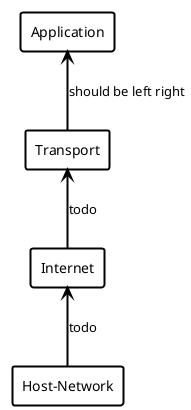

# Network Protocols

Define rules and format of communication between network devices.
- Can apply to hardware or software (e.g., directly connected devices and HTTPS)
- Can support mechanisms for efficient and reliable communication (message acknowledgement, data compression, etc.)

# Layered Models

Standard framework for interconnecting network protocols for end-to-end communication.
- Protocols should be modular and independent.

## Open Systems Interconnection (OSI)

Used to teach computer networking. Developed in 1970s.

<!--
Please Do Not Throw Sausage Pizza Away
-->

TODO PlantUML
1. Application
2. Presentation
3. Session
4. Transport
5. Network
6. Data Link
7. Physical

## Transmission Control Protocol / Internal Protocol (TCP/IP)

More widely-used abstraction model.
- Based on OSI.

TODO plantUML
1. Application
2. Transport
3. Internet
4. Host-Network

<!--

-->

> Breakdown of data units at each layer:
> 
> "Don't Smoke Pot From Bongs"
> 
> | Data Unit | TCP/IP Layer |
> |-----------|-----------|
> | Datagrams | App       |
> | Segments  | Transport |
> | Packets   | Network   |
> | Frames    | Data Link |
> | Bits      | Physical  |

# Data Encapsulation

Encapsulation: Application $\to$ Physical
- Information is encapsulated with header (and sometimes trailer) data on the way down.
- More info is added at each layer.

Decapsulation: Physical $\to$ Application
- Happens on the way back up the protocol stack.

> **Example**: Encapsulation
> 
> TODO Names
> 
> |   |              |           |                |      |               |
> |---|--------------|-----------|----------------|------|---------------|
> | 1 |              |           |                | Data |               |
> | 2 |              |           | TCP/UDP Header | Data |               |
> | 3 |              | IP Header | TCP/UDP Header | Data |               |
> | 4 | Frame Header | IP Header | TCP/UDP Header | Data | Frame Trailer |

## Physical Layer

Transmission of bits/waveform/timing/et cetera.

> Examples: coaxial, radio, fiber optic, et cetera.

Things to Consider:
- Security
- Bandwidth
- Ease of Installation

## Data Link Layer

Delivers data in a local network (or point-to-point).
- Data Units: Frame

### IEEE 802.3 (Ethernet)

- 48-bit MAC address: Unique ID 
	* 24-bits for manufacturer ID
	* 24-bits for device ID

### IEEE 802.11 (Wi-Fi)

- Data link layer devices (e.g., switches, bridges)

## Network Layer

Delivers data between hosts, possibly on different networks.
- Data Unit: Packet

### Internet Protocol (IPv4)

- 32-bit addresses
	* Usually written as four octes in dotted decimal *(e.g., `172.16.1.250`)*
- Network and host addresses

> Note: Current standard is IPv6

### Other Protocols

**Address Resolution Protocol (ARP)**: Resolves MAC address to corresponding IP address.

**Internet Control Message Protocol (ICMP)**: Allows hosts to communicate about network conditions.
- e.g., ICMP Destination Unreachable message

**Dynamic Host Configuration Protocol (DHCP)**: Dynamically assigns IP addresses. <!-- Bane of my existence. -->

## Transport layer

Delivers data from process on one host to process on another.
- *e.g., web browser on laptop talking to web server at NASA.*

> Port Numbers: Used to get the data to the correct process on a host.
> - **Well Known**: < 1024
> - **Registered and Dynamic**: > 49151

### Transmission Control Protocol (TCP)

Connection-oriented with reliable delivery, flow, and congestion control.
- Sequence numbers *(e.g., message 1/5)*, acknowledgement numbers (e.g., *SIN/ACK*)

> Flags: SYN, ACK, FIN, PSH, URG

> Most internet traffic uses TCP.

### Universal Control Protocol (UDP)

Connectionless, less overhead than TCP.
- Efficient for small transfers.
- Unreliable; no flow control, congestion control, or order.

> Basically, anything that buffers or can be lossy, is good for UDP.
> - Multicasting, streaming, tunneling, et cetera.

## Ap pl Display status of network connectionsication Layer Protocols

### Domain Name System (DNS)

Resolves domain names to IP addresses.

### Hypertext Transfer Protocol (HTTP/s)

Web browser/server interaction.

### Email

- Simple Mail Transfer Protocol (SMTP)
- Post Office Protocol (POP3) and IMAP 4

### Secure Shell (SSH)

Remote accessing other computers.

### File Transfer Protocol (FTP)

Sharing files between computers.

---

# Network Address Translation

Basic NAT: Translates one IP into another.
- e.g.,, mapping internal to external IP address.

Port Address Translation: Multiple hosts share one single public IP.

> Can be static or dynamic (IP assigned to you).

Benefits:
- Sharing IP addressses.
- Securing devices behind NAT device (less visible points of entry)

# Basic Networking Commands

| Command  | Description                           |
|----------|---------------------------------------|
| ipconfig | Display network interface config      |
| ping     | Send ICMP echo request                |
| netstat  | Display status of network connections |
| nslookup | DNS info                              |

# Layers and Devices

