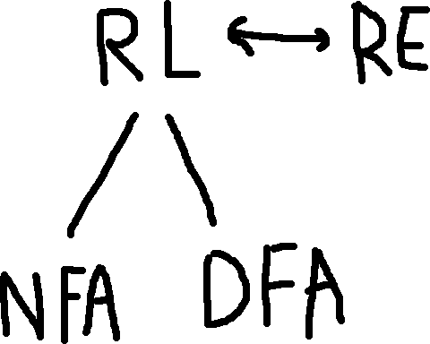

$R$ is a **regular expression** if $R$ is:
1. $a$ for some $a$ in the alphabet $\Sigma$,
2. $\epsilon$
3. $\phi$
4. $(R_1 \cup R_2)$, where $R_1$ and $R_2$ are regular expressions
5. $(R_1 \dot R_2)$, where $R_1$ and $R_2$ are regular expressions, or
6. $(R_1^*)$, where $R_1$ is a regular expression.

> **Layperson**: 1—3 describe the simplest base conditions, 4—6 say that we can do a bunch of operations with REs to make more complex REs.
> - 1—3 can be thought of as the base cases in a recursive function.

> **How Everything Relates**:
> 

> 
> - A regular language is a language that can be represented by a DFA/NFA.
> - A regular expression is a pattern that describes a regular language.

> **Regular Expression Shorthands**:
> - $(a \cup b)$ can be rewritten as $\Sigma$
> - $RR^+$ can be rewritten as $R^+$
> - The concatenation of $k$ $R$'s can be rewritten as $R^k$
> - Programming languages have tons of shorthand for REs.

## Examples

> Conversion of RL to RE, and vice versa.
> - Alphabet is `{0,1}`

