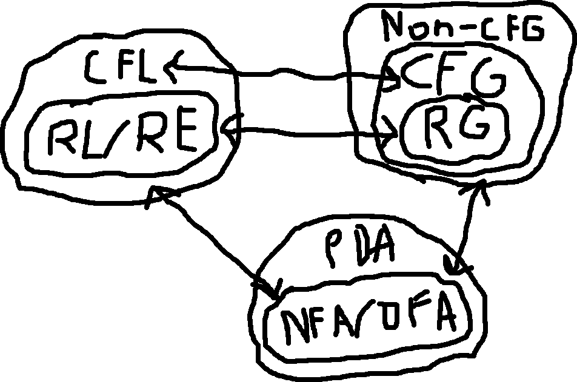

> I have no idea what this is about.

# Closure of CFLs

We know that CFLs are closed under the regular operations (closure properties)
- *e.g., union, concatenation, and star of CFLs are CFLs.*

Q: But, how can we prove it?

A: We can construct CFGs or PDAs for them.

Suppose two CFLs, $S_1$ and $S_2$

**Union**:

$$
S \to S_1 | S_2 \\
$$

**Concatenation**:

$$
S \to S_1 S_2
$$

**Star**:

$$
S \to \epsilon | S S_1
$$

# When is a Language Context-Free?

When a variable in a different context yields a different result.

$$
aV \to ab \\
Vc \to de
$$

For this class, since we don't know any formal method, we roll with reasoning about the PDA's stack.
- Technically, there is a pumping lemma for telling if a language is context-free; like how we used pumping lemma to tell if a language was regular; except we didn't learn it.

1. If the language cannot be done without reaching deeper into the stack, like:
	- $\{a^m b^n c^m d^n\}$ (can't compare `a` and `c`)
2. If language has no stack pattern, like:
	- $\{ a^n b^{2n}\}$ (infinite counting)

tl;dr, If you can't describe the language as "pop as like this and pop bs like that", it's not context-free.
 
## Examples

$$
\{ a^n b^{n+2} a^n \}
$$

The last a cannot be 

# Are all NFAs PDAs?

Yes, just ignore the stack (e.g., $a, \epsilon \to \epsilon$)

# Final Diagram

- A turing machine would wrap around PDA. It can do a lot of things, like moving the tape left and right.
	* But for this course, we just need to know:
		- Can the language be represented by NFA? 
		- Is this context-free? (without proof)
			* The proof, which we didn't learn, is like doing several pumping lemma proofs.
