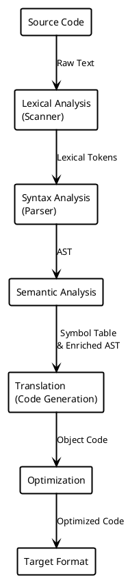

# Questions

**Question**: Name some of the most-important paradigms of programming languages.

**Answer**: Imperative/Procedural, Function/Declarative/Applicative, Logical/Constraint, OOP

---

**Question**: Draw diagram showing stages of compilation

**Answer**:

---

**Question**: What is (when it comes to variables) aliasing?

**Answer**: The situation in which a memory address has more than one name.

# Things to Know

> Review session was the professor scrolling through all his notes in full, not really singling out any specific topics.

Really, just know everything.

Below are things that I jotted down for no reason other than to fill gaps in my own notes/knowledge.

TODO Integrate/check info below against main notes.

What makes a good language?
1. Simplicity: Small or big feature sets?
2. Orthogonality: Combine features in ways that are easy to understand?
	- Less exceptions === Easier to understand language.
3. Level of Abstraction: Degree to which language allows powerful data abstractions.
4. Portability: Is it easy to move programs between systems?
	- Binary, code, whatever.
5. Cost: Literally any costs of using language
	- Royalties/licensing, compilation, maintenance, execution, training, etc.
6. Expressivity: Different ways to solve same problem?
	- Are you being restricted?
	- In conflict with simplicity and orthogonality (makes feature sets larger)

Variables
- Know symbol table (L/R value)

When it comes to visibility, understand how visibility stacks inwards.
