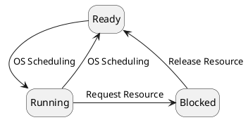

# Process Concept

**Process**: Instance of a program being executed.
- The OS itself is organized as a collection of processes.
- The OS tracks a process with a process control block (PCB)

**Process Control Block**: The concrete representation of a process.
- Independent data structure that holds information on a process, such as:
	- Current instruction address,
	- Execution stack,
	- Resources used,
	- Program being executed

# Process States and Transitions

## Simple Diagram

> Newly created processes begin in the Ready state.

- **OS Scheduling**:
	* The OS selects a process from the Ready queue to execute, moving it to the Running state.
	* The OS interrupts a running process *(e.g., its time slice expires)*, moving it back to the Ready state.
- **Request Resource**: The running process requests a resource that is currently unavailable (e.g., I/O), moving it to the Blocked state.
- **Release Resource**: The requested resource becomes available, and the OS moves the process from the Blocked state back to the Ready state.

## Additional State Transitions

<!--
TODO PlantUML diagram (this is so hard, though)
-->

Some operating systems provide more complex states and transitions, such as:
- **New State**: A newly created process is placed here.
	- *(e.g., to regulate the # of processes completing for the CPU)*
	- When a process transitions to the Ready state, this is called "Activate" (this is a one-way transition)
- **Suspended State**: Process goes here whenever, even if CPU and resources are available.
	- *(e.g., to regulate performance or allow debugging)*
	- A process can be sent here from Ready, Running, or Blocked.
		* Processes that are suspended can only reactivate as Ready or Blocked, but not running.
- **Terminated State**: Process goes here when execution can no longer continue, but before the PCB is deleted.
	- *(e.g., to examine the final state of a process that comitted a fatal error)*
	- A process can be sent here from Ready, Running, or Blocked.

# Context Switch

**Context Switch**: Transfer of control from one process to another.
- May be triggered by OS for scheduling reasons or caused current process's inability to continue.

**CPU State**: All intermediate values held in any CPU registers and hardware flags at the time of interruption.
- The OS saved and loads CPU states when context switching.

> **Note**: The PCB contains an up-to-date copy of CPU state only when a process's state is ready or blocked.

# Virtual CPUs

Structuring an application as processes allows for independence from:
1. Number of CPUs, and
2. Type of CPU
