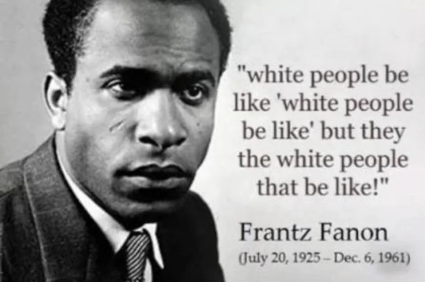

# HST4433: Nonviolence in the Modern World

# Topics

## I. The Philosophy of Violence and Nonviolence
- [The Epistemology of Political Nonviolence](01.html)
- [The Logic of the State and Mythic Violence](02.html)
- [Systemic Violence vs. Political Cruelty](03.html)

## II. Rights, Economics, and Alienation
- [Human Rights and Statelessness](04.html)
- [Economic Mythology and Pre-Capitalist Exchange](05.html)
- [Capitalism and Worker Alienation](06.html)

## III. Race, Institutions, and the American Paradigm
- [American Rage-Murder](07.html)
- [The Construction of Race and Innocence](08.html)
- [The Mechanics of Segregation and Neocolonialism](09.html)

# ???

