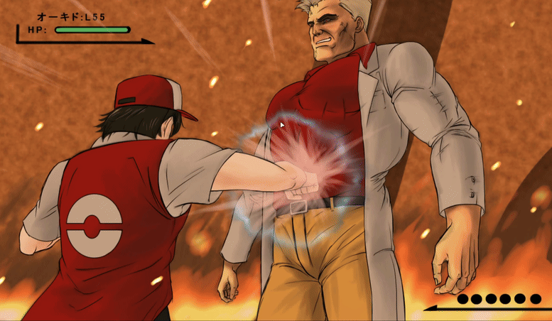
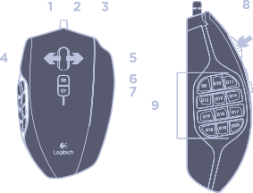

<style> 
img { width: 60% }
img[src$=".gif"] { width: 100% }
</style>

# Mods

## Aesthetic

- Theme: [Catppuccin Mocha PC Theme](https://github.com/WusialaMMO/catppuccin-pc-theme-pokemmo)
- Followers: [Complete PokeMMO Follower Sprites](https://forums.pokemmo.com/index.php?/topic/138391-complete-pokemmo-follower-sprites-updated-and-fixed-version-legendary-and-forms-included/)
- Music: [PokeMMO Music Remastered](https://forums.pokemmo.com/index.php?/topic/150396-mod-pokemmo-music-remastered-complete-music-overhaul/)

> **Aside**: Catppuccin Installation
> 
> Catppuccin is available via GitHub and can be cloned directly into the mod folder like:
> 
> ```bash
> cd ~/.var/app/com.pokemmo.PokeMMO/data/pokemmo-client-live/data/mods/
> git clone "https://github.com/WusialaMMO/catppuccin-pc-theme-pokemmo" --depth 1
> ```
> 
> > *Assuming installed via Flatpak*

## Utility

- Strings: [SupersStrings!](https://forums.pokemmo.com/index.php?/topic/188112-supersstrings/)
- Weakness Chart: [Bullseye Injector](https://github.com/UncleTyrone/Bullseye-Injector)

> **Aside**: [**IMPORTANT**] — Bullseye Injector Scaling Fix
> 
> In `./sprites/battlesprites/table-summary-scale.txt`:
> - Replace all instances of `2.70` with `1.75`

> **Aside**: What is a String mod?
> 
> All game text (strings) can be dumped to XML and customized. This can improve information density and readability.
> 
> Things you can do:
> 1. Battle Data: Replace generic text with raw data (e.g., displaying "`[+SpA|-Atk]`" next to Natures so I don't have to memorize)
> 2. Clean Logs: Shorten verbose battle messages and make battle log readable at a glance.
> 3. Flow: Merge fragmented sentences into full paragraphs.

> **Aside**: What is Bullseye?
> 
> Bullseye is a sprite mod that modifies every single Pokemon sprite to have some symbols next to it that display its type weaknesses.
> 
> This is useful if you can't remember type weaknesses, and in certain situations (e.g., double battles) the vanilla UI won't tell you whether a move is effective.

# Input & Ergonomics

## Radial Menu

I use [Kando](https://github.com/kando-menu/kando) to create a visual radial menu for common UI shortcuts. I strictly map one gesture $\to$ one keypress. It's slower than keyboard hotkeys, but much more comfortable for long sessions.



> My Kando Config: [`menus.json`](https://codeberg.org/Inevitabby/dotfiles/src/branch/master/.var/app/menu.kando.Kando/config/kando/menus.json)

> **Aside**: Kando via Gamepad
> 
> **My Controller**: Xbox 360 Wireless Controller w/ Abysmal Stick Drift 🥀
> 
> Gamepad support is iffy because PokeMMO's UX is dated, but country girls make do.
> 
> My main QOL improvement is that I bound my "Guide" button to trigger Kando via AntiMicroX.
> 
> Gamepad input to a Flatpak Chromium/Electron/Whatever app is scuffed so I had to add read-only udev permissions (`/run/udev:ro`) via Flatseal.

## Mouse Input

I map navigation and primary actions to the mouse side-buttons using [Piper](https://github.com/libratbag/piper). These are saved to the mouse's on-board memory as strict 1:1 bindings, sending standard keyboard signals.



| Mouse Key       | Function   | Key         |
|-----------------|------------|-------------|
| G10,G12,G13,G14 | Movement   | `Arrow Key` |
| M3              | A button   | `Space`     |
| G11             | B button   | `x`         |
| G15             | Shortcut 8 | `f`         |
| G16             | Shortcut 9 | `s`         |
| G17             | Shortcut 7 | `t`         |

> **Aside**: Other Keys
> 
> My remaining buttons are for tiled window managment and don't interact with the game client. 
> 
> I have a complete write-up [here](https://inevitabby.com/blog/productivity-tools/#mouse).

# Game Keybinds

## General

Key A: `<Spacebar>`

> **Aside**: Reduced Keybinds 
> 
> On my laptop I use `hjkl` for movement, as I find it more comfortable on the tiny form factor. 

## Overworld Hotbar

| Keybind | `1` |  `2`  | `L`  |  `R`  | `Z`  | `M` |   `T`    |    `F`    |     `S`     |
|---------|:---:|:-----:|:----:|:-----:|:----:|:---:|:--------:|:---------:|:-----------:|
| Item    |     | Defog | Lure | Repel | Bike | Map | Teleport | Super Rod | Sweet Scent |

## Battle Hotbar

| Keybind         |    `1`     |    `2`     |    `L`     |    `R`    |    `Z`    |
|-----------------|:----------:|:----------:|:----------:|:---------:|:---------:|
| Item            | Great Ball | Ultra Ball | Quick Ball | Dusk Ball | Poké Ball |

## Gamepad

TODO I haven't settled on a strong control scheme yet.
